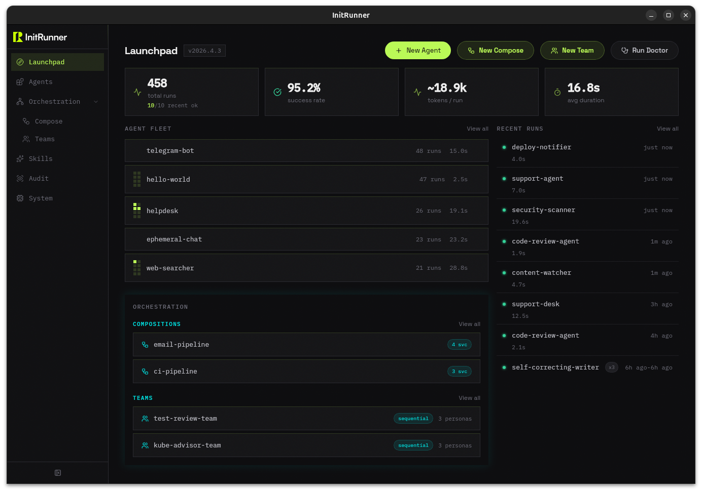

# InitRunner

<p align="center">
  <picture>
    <source media="(prefers-color-scheme: dark)" srcset="assets/logo-dark.svg">
    <source media="(prefers-color-scheme: light)" srcset="assets/logo-light.svg">
    
  </picture>
</p>

<p align="center">
  <a href="https://pypi.org/project/initrunner/"></a>
  <a href="https://pypi.org/project/initrunner/"></a>
  <a href="https://hub.docker.com/r/vladkesler/initrunner"></a>
  <a href="LICENSE-MIT"></a>
  <a href="https://ai.pydantic.dev/"></a>
  <a href="https://discord.gg/GRTZmVcW"></a>
</p>

<p align="center">
  <a href="https://initrunner.ai/">公式サイト</a> · <a href="https://initrunner.ai/docs">ドキュメント</a> · <a href="https://hub.initrunner.ai/">InitHub</a> · <a href="https://discord.gg/GRTZmVcW">Discord</a>
</p>

<p align="center">
  <a href="README.md">English</a> · <a href="README.zh-CN.md">简体中文</a> · 日本語
</p>

> **注意:** これはコミュニティによる翻訳です。最新の情報は [英語版 README](README.md) を参照してください。翻訳は更新に遅れる場合があります。

1つの YAML ファイルでエージェントを定義。対話する。うまくいったら自律実行させる。信頼できたら、cron スケジュール、ファイル変更、webhook、Telegram メッセージに反応するデーモンとしてデプロイする。同じファイルのまま。プロトタイプから本番まで書き直し不要。

```bash
initrunner run researcher -i                            # 対話する
initrunner run researcher -a -p "Audit this codebase"   # 自律的に作業させる
initrunner run researcher --daemon                      # 24時間365日稼働、トリガーに反応
```

## クイックスタート

```bash
curl -fsSL https://initrunner.ai/install.sh | sh
initrunner setup        # ウィザード：プロバイダー、モデル、API キーを選択
```

または: `uv pip install "initrunner[recommended]"` / `pipx install "initrunner[recommended]"`。[インストールガイド](docs/getting-started/installation.md) を参照。

### スターター

`initrunner run --list` で全カタログを表示。モデルは API キーから自動検出されます。

| スターター | 機能 |
|-----------|------|
| `helpdesk` | ドキュメントを読み込み、引用とメモリ付き Q&A エージェントを取得 |
| `deep-researcher` | 3 エージェントパイプライン：プランナー、Web リサーチャー、シンセサイザー |
| `code-review-team` | 多視点レビュー：アーキテクト、セキュリティ、メンテナー |
| `codebase-analyst` | リポジトリをインデックスし、アーキテクチャについて対話、セッション間でパターンを学習 |
| `content-pipeline` | 調査、執筆、編集/ファクトチェック（webhook または cron 経由） |
| `email-agent` | 受信トレイを監視、メッセージを分類、返信を起草、緊急メールを Slack に通知 |

### 自分で作る

```bash
initrunner new "a research assistant that summarizes papers"
# role.yaml を生成し、「今すぐ実行しますか？[Y/n]」と尋ねる

initrunner new "a regex explainer" --run "what does ^[a-z]+$ match?"
# 1コマンドで生成と実行

initrunner run --ingest ./docs/    # YAML をスキップして、ドキュメントと直接対話
```

[InitHub](https://hub.initrunner.ai/) でコミュニティエージェントを検索・インストール: `initrunner search "code review"` / `initrunner install alice/code-reviewer`。

**Docker:**

```bash
docker run --rm -it -e OPENAI_API_KEY ghcr.io/vladkesler/initrunner:latest run -i
```

## 1つのファイル、4つのモード

ロールファイル：

```yaml
apiVersion: initrunner/v1
kind: Agent
metadata:
  name: code-reviewer
  description: Reviews code for bugs and style issues
spec:
  role: |
    You are a senior engineer. Review code for correctness and readability.
    Use git tools to examine changes and read files for context.
  model: { provider: openai, name: gpt-5-mini }
  tools:
    - type: git
      repo_path: .
    - type: filesystem
      root_path: .
      read_only: true
```

このファイルは4つの方法で使えます：

```bash
initrunner run reviewer.yaml -i              # インタラクティブ REPL
initrunner run reviewer.yaml -p "Review PR #42"  # 1つのプロンプト、1つの応答
initrunner run reviewer.yaml -a -p "Audit the whole repo"  # 自律モード：計画、実行、振り返り
initrunner run reviewer.yaml --daemon        # 継続稼働、トリガーに反応
```

`model:` セクションはオプション。省略すると InitRunner が API キーから自動検出します。Anthropic、OpenAI、Google、Groq、Mistral、Cohere、xAI、OpenRouter、Ollama、および任意の OpenAI 互換エンドポイントに対応。

### 自律モード

`-a` を付けるとエージェントはチャットボットではなくなります。タスクリストを作り、各項目を処理し、自身の進捗を振り返り、すべて完了したら終了します。4つの推論戦略が思考方法を制御：`react`（デフォルト）、`todo_driven`、`plan_execute`、`reflexion`。

```yaml
spec:
  autonomy:
    compaction: { enabled: true, threshold: 30 }
  guardrails:
    max_iterations: 15
    autonomous_token_budget: 100000
    autonomous_timeout_seconds: 600
```

スピンガードが進展のないループを検出。ヒストリーコンパクションが古いコンテキストを要約し、長時間実行でもトークンウィンドウを圧迫しません。予算制約、イテレーション制限、ウォールクロックタイムアウトですべてが有界に。[自律実行](docs/orchestration/autonomy.md) · [ガードレール](docs/configuration/guardrails.md) を参照。

### デーモンモード

トリガーを追加して `--daemon` に切り替え。エージェントは継続稼働し、イベントに反応。各イベントが1回のプロンプト-応答サイクルを起動。

```yaml
spec:
  triggers:
    - type: cron
      schedule: "0 9 * * 1"
      prompt: "Generate the weekly status report."
    - type: file_watch
      paths: [./src]
      prompt_template: "File changed: {path}. Review it."
    - type: telegram
      allowed_user_ids: [123456789]
```

```bash
initrunner run role.yaml --daemon   # Ctrl+C まで実行
```

6種類のトリガー：cron、webhook、file_watch、heartbeat、telegram、discord。再起動なしでロール変更をホットリロード、最大4トリガーを同時実行。[トリガー](docs/core/triggers.md) を参照。

### オートパイロット

`--autopilot` は `--daemon` と同じですが、各トリガーが完全な自律ループを実行。Telegram ボットに「来週ニューヨークからロンドンへのフライトを探して」とメッセージが来たとき、デーモンモードでは1回で回答。オートパイロットでは、エージェントが Web を検索し、オプションを比較し、日程を確認し、読む価値のある回答を返します。

```bash
initrunner run role.yaml --autopilot
```

選択的に設定することも可能。個別のトリガーに `autonomous: true` を設定し、残りはシングルショット応答のまま：

```yaml
spec:
  triggers:
    - type: telegram
      autonomous: true          # 考え、調査し、返信
    - type: cron
      schedule: "0 9 * * 1"
      prompt: "Generate the weekly status report."
      autonomous: true          # 計画、データ収集、執筆、レビュー
    - type: file_watch
      paths: [./src]
      prompt_template: "File changed: {path}. Review it."
      # デフォルト：クイックシングル応答
```

### メモリはすべてを貫く

エピソード記憶、セマンティック記憶、手続き記憶がインタラクティブセッション、自律実行、デーモントリガーの間で永続化。各セッション後、統合プロセスが LLM を使って会話から永続的な事実を抽出。エージェントは1回の実行内だけでなく、時間をかけてナレッジを蓄積します。

## 学習するエージェント

エージェントをディレクトリに向けるだけ。ドキュメントを自動的に抽出、チャンク分割、埋め込み、インデックス。会話中、エージェントは自動でインデックスを検索し、見つけた内容を引用。新規・変更ファイルは毎回の実行で自動再インデックス。

```yaml
spec:
  ingest:
    auto: true
    sources: ["./docs/**/*.md", "./docs/**/*.pdf"]
  memory:
    semantic:
      max_memories: 1000
```

```bash
cd ~/myproject
initrunner run codebase-analyst -i   # コードをインデックスし、Q&A を開始
```

重要なのは統合です。各セッション後、LLM が何が起きたかを読み取り、セマンティックストアに蒸留します。火曜日のデバッグセッションで学んだ事実が、木曜日のコードレビュー時に現れます。Flow の共有メモリにより、エージェントチームが共同でナレッジを構築。[メモリ](docs/core/memory.md) · [取り込み](docs/core/ingestion.md) · [RAG クイックスタート](docs/getting-started/rag-quickstart.md) を参照。

## セキュリティは設定、配管工事ではない

ほとんどのエージェントフレームワークはセキュリティを「本番になったら認証ミドルウェアを追加」として扱います。InitRunner はセキュリティを統合済みで出荷。設定キーで有効化するだけで、週末を費やして配管工事する必要はありません。

**エージェントは信頼できない入力を受け付ける。** コンテンツポリシーエンジン（禁止パターン、プロンプト長制限、オプションの LLM トピック分類器）と入力ガードケイパビリティがエージェント開始前にプロンプトを検証。

**エージェントは実際の影響があるツールを呼び出す。** [InitGuard](https://github.com/initrunner/initguard) ABAC ポリシーエンジンがすべてのツール呼び出しと委任を CEL ポリシーに対してチェック。ツールごとの allow/deny glob パターンで引数レベルのパーミッションを適用。

**エージェントはコードを実行する。** PEP 578 監査フックサンドボックスがファイルシステム書き込みを制限、サブプロセス生成をブロック、プライベート IP ネットワークアクセスをブロック、危険なインポートを防止。Docker コンテナサンドボックスが読み取り専用 rootfs、メモリ/CPU 制限、ネットワーク分離を追加。

**すべてが記録される。** 追記専用 SQLite 監査証跡、自動シークレットスクラブ。正規表現パターンがプロンプトと出力から GitHub トークン、AWS キー、Stripe キーなどを除去。

これらは `security:` 設定キーによるオプトイン方式。自動的には有効になりません。`security:` セクションのないロールは安全なデフォルト値が適用されます。これらの機能が本番稼働6か月後にサードパーティから追加するものではなく、フレームワーク内に存在していることが重要です。

```bash
export INITRUNNER_POLICY_DIR=./policies
initrunner run role.yaml    # ツール呼び出し + 委任をポリシーに対してチェック
```

[エージェントポリシー](docs/security/agent-policy.md) · [セキュリティ](docs/security/security.md) · [ガードレール](docs/configuration/guardrails.md) を参照。

## コスト管理

トークン予算は基本。InitRunner は USD コスト予算もサポート。デーモンに日次または週次のドル上限を設定し、閾値に達したらトリガーの発火を停止。

```yaml
spec:
  guardrails:
    daemon_daily_cost_budget: 5.00    # 日あたり USD
    daemon_weekly_cost_budget: 25.00  # 週あたり USD
```

コスト見積もりは [genai-prices](https://pypi.org/project/genai-prices/) を使用して、モデルとプロバイダーごとの実際の支出を計算。各実行のコストは監査証跡に記録。ダッシュボードではエージェントと期間を横断したコスト分析を表示。[コスト追跡](docs/core/cost-tracking.md) を参照。

## マルチエージェントオーケストレーション

エージェントを Flow に連鎖。あるエージェントの出力が次の入力に。センスルーティングがまずキーワードスコアリングでターゲットを自動選択（API 呼び出しゼロ）、キーワードが曖昧な場合のみ LLM でタイブレーク：

```yaml
apiVersion: initrunner/v1
kind: Flow
metadata: { name: email-chain }
spec:
  agents:
    inbox-watcher:
      role: roles/inbox-watcher.yaml
      sink: { type: delegate, target: triager }
    triager:
      role: roles/triager.yaml
      sink: { type: delegate, strategy: sense, target: [researcher, responder] }
    researcher: { role: roles/researcher.yaml }
    responder: { role: roles/responder.yaml }
```

```bash
initrunner flow up flow.yaml
```

**チームモード** は、完全な Flow を構築するほどではないが、1つのタスクに複数の視点が必要な場合に使用。1つのファイルでペルソナを定義、3つの戦略：順次ハンドオフ、並列実行、またはディベート（多ラウンドの議論と統合）。[パターンガイド](docs/orchestration/patterns-guide.md) · [チームモード](docs/orchestration/team_mode.md) · [Flow](docs/orchestration/flow.md) を参照。

## MCP とインターフェース

エージェントは任意の [MCP](https://modelcontextprotocol.io/) サーバーをツールソースとして利用可能（stdio、SSE、streamable-http）。逆方向も可能で、エージェントを MCP ツールとして公開し、Claude Code、Cursor、Windsurf から呼び出せます：

```bash
initrunner mcp serve agent.yaml          # エージェントが MCP ツールになる
initrunner mcp toolkit --tools search,sql  # LLM 不要で生ツールを公開
```

[MCP Gateway](docs/interfaces/mcp-gateway.md) を参照。

<p align="center">
  <br>
  <em>ダッシュボード：エージェント実行、Flow 構築、監査証跡の確認</em>
</p>

```bash
pip install "initrunner[dashboard]"
initrunner dashboard                  # http://localhost:8100 を開く
```

ネイティブデスクトップウィンドウとしても利用可能（`initrunner desktop`）。[ダッシュボード](docs/interfaces/dashboard.md) を参照。

## その他の機能

| 機能 | コマンド / 設定 | ドキュメント |
|-----|---------------|------------|
| **スキル**（再利用可能なツール + プロンプトバンドル） | `spec: { skills: [../skills/web-researcher] }` | [Skills](docs/agents/skills_feature.md) |
| **API サーバー**（OpenAI 互換エンドポイント） | `initrunner run agent.yaml --serve --port 3000` | [Server](docs/interfaces/server.md) |
| **A2A サーバー**（エージェント間プロトコル） | `initrunner a2a serve agent.yaml` | [A2A](docs/interfaces/a2a.md) |
| **マルチモーダル**（画像、音声、動画、ドキュメント） | `initrunner run role.yaml -p "Describe" -A photo.png` | [Multimodal](docs/core/multimodal.md) |
| **構造化出力**（バリデーション済み JSON スキーマ） | `spec: { output: { schema: {...} } }` | [Structured Output](docs/core/structured-output.md) |
| **評価**（エージェント出力品質のテスト） | `initrunner test role.yaml -s eval.yaml` | [Evals](docs/core/evals.md) |
| **ケイパビリティ**（ネイティブ PydanticAI 機能） | `spec: { capabilities: [Thinking, WebSearch] }` | [Capabilities](docs/core/capabilities.md) |
| **オブザーバビリティ**（OpenTelemetry） | `spec: { observability: { enabled: true } }` | [Observability](docs/core/observability.md) |
| **推論**（構造化思考パターン） | `spec: { reasoning: { pattern: plan_execute } }` | [Reasoning](docs/core/reasoning.md) |
| **ツール検索**（オンデマンドツール発見） | `spec: { tool_search: { enabled: true } }` | [Tool Search](docs/core/tool-search.md) |
| **設定変更**（プロバイダー/モデル切替） | `initrunner configure role.yaml --provider groq` | [Providers](docs/configuration/providers.md) |

## アーキテクチャ

```
initrunner/
  agent/        ロールスキーマ、ローダー、エグゼキューター、自己登録ツール
  runner/       ワンショット、REPL、自律、デーモン実行モード
  flow/         flow.yaml によるマルチエージェントオーケストレーション
  triggers/     Cron、ファイルウォッチャー、webhook、ハートビート、Telegram、Discord
  stores/       ドキュメント + メモリストア（LanceDB、zvec）
  ingestion/    抽出 -> チャンク分割 -> 埋め込み -> 格納 パイプライン
  mcp/          MCP サーバー統合とゲートウェイ
  audit/        追記専用 SQLite 監査証跡、シークレットスクラブ付き
  services/     共有ビジネスロジック層
  cli/          Typer + Rich CLI エントリーポイント
```

[PydanticAI](https://ai.pydantic.dev/) ベースで構築。開発セットアップは [CONTRIBUTING.md](CONTRIBUTING.md) を参照。

## 配布

**InitHub:** [hub.initrunner.ai](https://hub.initrunner.ai/) でコミュニティエージェントを検索・インストール。`initrunner publish` で公開。

**OCI レジストリ:** ロールバンドルを任意の OCI 準拠レジストリにプッシュ: `initrunner publish oci://ghcr.io/org/my-agent --tag 1.0.0`。[OCI 配布](docs/core/oci-distribution.md) を参照。

**クラウドデプロイ:**

[](https://railway.com/template/FROM_REPO?referralCode=...)
[](https://render.com/deploy?repo=https://github.com/vladkesler/initrunner)

## ドキュメント

| 領域 | 主要ドキュメント |
|------|---------------|
| 入門 | [Installation](docs/getting-started/installation.md) · [Setup](docs/getting-started/setup.md) · [Tutorial](docs/getting-started/tutorial.md) · [CLI Reference](docs/getting-started/cli.md) |
| クイックスタート | [RAG](docs/getting-started/rag-quickstart.md) · [Docker](docs/getting-started/docker.md) · [Discord Bot](docs/getting-started/discord.md) · [Telegram Bot](docs/getting-started/telegram.md) |
| エージェントとツール | [Tools](docs/agents/tools.md) · [Tool Creation](docs/agents/tool_creation.md) · [Tool Search](docs/core/tool-search.md) · [Skills](docs/agents/skills_feature.md) · [Providers](docs/configuration/providers.md) |
| インテリジェンス | [Reasoning](docs/core/reasoning.md) · [Intent Sensing](docs/core/intent_sensing.md) · [Autonomy](docs/orchestration/autonomy.md) · [Structured Output](docs/core/structured-output.md) |
| ナレッジとメモリ | [Ingestion](docs/core/ingestion.md) · [Memory](docs/core/memory.md) · [Multimodal Input](docs/core/multimodal.md) |
| オーケストレーション | [Patterns Guide](docs/orchestration/patterns-guide.md) · [Flow](docs/orchestration/flow.md) · [Delegation](docs/orchestration/delegation.md) · [Team Mode](docs/orchestration/team_mode.md) · [Triggers](docs/core/triggers.md) |
| インターフェース | [Dashboard](docs/interfaces/dashboard.md) · [API Server](docs/interfaces/server.md) · [MCP Gateway](docs/interfaces/mcp-gateway.md) · [A2A](docs/interfaces/a2a.md) |
| 配布 | [OCI Distribution](docs/core/oci-distribution.md) · [Shareable Templates](docs/getting-started/shareable-templates.md) |
| セキュリティ | [Security Model](docs/security/security.md) · [Agent Policy](docs/security/agent-policy.md) · [Guardrails](docs/configuration/guardrails.md) |
| 運用 | [Audit](docs/core/audit.md) · [Cost Tracking](docs/core/cost-tracking.md) · [Reports](docs/core/reports.md) · [Evals](docs/core/evals.md) · [Doctor](docs/operations/doctor.md) · [Observability](docs/core/observability.md) · [CI/CD](docs/operations/cicd.md) |

## サンプル

```bash
initrunner examples list               # すべてのエージェント、チーム、Flow を一覧
initrunner examples copy code-reviewer # カレントディレクトリにコピー
```

## アップグレード

`initrunner doctor --role role.yaml` でロールファイルの非推奨フィールド、スキーマエラー、仕様バージョンの問題をチェック。`--fix` で自動修復。[非推奨事項](docs/operations/deprecations.md) を参照。

## コミュニティ

- [Discord](https://discord.gg/GRTZmVcW): チャット、質問、ロール共有
- [GitHub Issues](https://github.com/vladkesler/initrunner/issues): バグ報告と機能リクエスト
- [Changelog](CHANGELOG.md): リリースノート
- [CONTRIBUTING.md](CONTRIBUTING.md): 開発セットアップと PR ガイドライン

## ライセンス

[MIT](LICENSE-MIT) または [Apache-2.0](LICENSE-APACHE) のいずれかのライセンスで提供。

---

<p align="center"><sub>v2026.4.12</sub></p>
