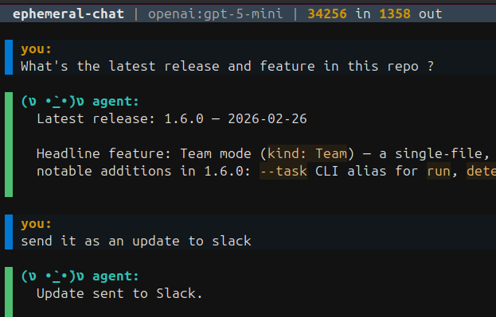

# InitRunner

<p align="center"></p>

<p align="center">
  
  <a href="https://pypi.org/project/initrunner/"></a>
  <a href="https://pypi.org/project/initrunner/"></a>
  <a href="https://github.com/vladkesler/initrunner"></a>
  <a href="https://hub.docker.com/r/vladkesler/initrunner"></a>
  <a href="LICENSE"></a>
  <a href="tests/"></a>
  <a href="https://github.com/astral-sh/ruff"></a>
  <a href="https://ai.pydantic.dev/"></a>
  <a href="https://initrunner.ai/"></a>
  <a href="https://discord.gg/GRTZmVcW"></a>
</p>

<p align="center">
  <a href="https://initrunner.ai/">Website</a> · <a href="https://initrunner.ai/docs">Docs</a> · <a href="https://discord.gg/GRTZmVcW">Discord</a> · <a href="https://github.com/vladkesler/initrunner/issues">Issues</a>
</p>

**Define AI agents in YAML. Run them as CLI tools, Telegram bots, Discord bots, API servers, or autonomous daemons. Built-in RAG, persistent memory, 40+ tools. Any model.**

One YAML file is all it takes to go from idea to running agent - with document search, persistent memory, and tools wired in automatically. Start with `initrunner chat` for a zero-config assistant, then scale to bots, pipelines, and API servers without rewriting anything.

> **v1.8.1** -- Cloud deploy templates (Railway, Render, Fly.io) and auto-seeded example roles. See the [Changelog](CHANGELOG.md) for details.

## 30-Second Quickstart

```bash
pip install "initrunner[all]"
export OPENAI_API_KEY=sk-...
initrunner chat --ingest ./my-docs/
```

That's it. You have an AI agent that knows your docs and remembers across sessions.

> `--ingest` embeds documents with OpenAI by default. Using another provider? See [RAG Quickstart](docs/getting-started/rag-quickstart.md#embedding-api-key) to configure embeddings.

## Try It

```bash
initrunner chat --ingest ./docs/   # chat with your docs, memory on by default
>>> summarize the getting started guide
The guide covers installation, creating your first agent with a role.yaml file, ...

>>> what retrieval strategies does it mention?
The docs describe three strategies: full-text search, semantic similarity, ...

>>> /quit
```

No YAML, no config files. Add `--tool-profile all` to enable every built-in tool.

## Define Agent Roles in YAML

When you need more control, define an agent as a YAML file:

```yaml
apiVersion: initrunner/v1
kind: Agent
metadata:
  name: code-reviewer
  description: Reviews code for bugs and style issues
spec:
  role: |
    You are a senior engineer. Review code for correctness and readability.
    Use git tools to examine changes and read files for context.
  model: { provider: openai, name: gpt-5-mini }
  tools:
    - type: git
      repo_path: .
    - type: filesystem
      root_path: .
      read_only: true
```

```bash
initrunner run reviewer.yaml -p "Review the latest commit"
```

That's it. No Python, no boilerplate. Using Claude? `pip install "initrunner[anthropic]"` and set `model: { provider: anthropic, name: claude-opus-4-6 }`.

<p align="center">
  <br>
  <em>Quick Chat - ask a question, send the answer to Slack</em>
</p>

## Why InitRunner

**Zero config to start.** `initrunner chat` gives you an AI assistant with persistent memory and document search out of the box. No YAML, no setup beyond an API key.

**Config, not code.** Define your agent's tools, knowledge base, and memory in one YAML file. No framework boilerplate, no wiring classes together. 16 built-in tools (filesystem, git, HTTP, Python, shell, SQL, search, email, MCP, and more) work out of the box. Need a custom tool? One file, one decorator.

**Version-control your agents.** Agent configs are plain text. Diff them, review them in PRs, validate in CI, reproduce anywhere. Your agent definition lives next to your code.

**Prototype to production.** Same YAML runs as an interactive chat, a one-shot CLI command, a trigger-driven daemon, or an OpenAI-compatible API. No rewrite when you're ready to deploy.

## How It Compares

|  | InitRunner | Build from scratch | LangChain |
|---|---|---|---|
| **Setup** | `pip install initrunner` + API key | Install 5-10 packages, write glue code | `pip install langchain` + adapters |
| **Agent config** | One YAML file | Python classes + wiring | Python chains + config objects |
| **RAG** | `--ingest ./docs/` (one flag) | Embed, store, retrieve, prompt - DIY | Loaders > splitters > vectorstore chain |
| **Bot deployment** | `--telegram` / `--discord` flag | Build bot framework integration | Separate bot framework + adapter |
| **Model switching** | Change `model.provider` in YAML | Rewrite client code | Swap LLM class + adjust prompts |
| **Multi-agent** | `compose.yaml` with delegation | Custom orchestration layer | Agent executor + custom routing |

## What Can You Build?

- **A Telegram bot that answers questions about your codebase** - point it at your repo, deploy with one flag
- **A cron job that monitors competitors and sends daily digests** - cron trigger + web scraper + Slack sink
- **A document Q&A agent for your team's knowledge base** - ingest PDFs and Markdown, serve as an API
- **A code review bot triggered by new commits** - file-watch trigger + git tools + structured output
- **A multi-agent pipeline: inbox watcher > triager > responder** - define in `compose.yaml`, run with one command
- **A personal assistant that remembers everything** - persistent memory across sessions, no setup

## Quickstart

### 1. Install

```bash
curl -fsSL https://initrunner.ai/install.sh | sh
```

Or with a package manager:

```bash
pip install "initrunner[all]"       # everything included
pip install initrunner              # core only (OpenAI)
uv tool install initrunner          # or with uv
```

Common extras: `anthropic` (Claude), `ingest` (PDF/DOCX), `dashboard` (web UI), `all` (everything). See [Installation docs](docs/getting-started/installation.md) for the full extras table and platform notes.

### 2. Set your API key

```bash
export OPENAI_API_KEY=sk-...          # OpenAI (default)
export ANTHROPIC_API_KEY=sk-ant-...   # Claude
```

You can also store keys in `~/.initrunner/.env` - it's loaded automatically by all commands. Environment variables set in the shell take precedence over `.env` values.

> Or run `initrunner setup` - it walks through provider, key, and first role interactively, and stores the key in `~/.initrunner/.env` for you.

### 3. Start chatting

```bash
initrunner chat                        # zero-config chat with persistent memory
initrunner chat --resume               # resume previous session + auto-recall memories
initrunner chat --ingest ./docs/       # chat with your documents (instant RAG)
initrunner chat --tool-profile all     # chat with all tools enabled
initrunner chat --telegram             # one-command Telegram bot
initrunner chat --telegram --allowed-user-ids 123456789  # restrict access
initrunner run role.yaml -p "Hello!"   # one-shot prompt
initrunner run role.yaml -i            # interactive REPL
```

> **Embedding note:** `--ingest` uses OpenAI embeddings by default (`text-embedding-3-small`). Anthropic and other non-OpenAI users also need `OPENAI_API_KEY` set, or can switch embedding providers in their role YAML. See [RAG Quickstart](docs/getting-started/rag-quickstart.md).

Memory is on by default - the agent remembers facts across sessions. Use `--no-memory` to disable. See [Chat docs](docs/getting-started/chat.md) for all options, and [CLI Reference](docs/getting-started/cli.md) for the full command list.

## From Simple to Powerful

Start with the code-reviewer above. Each step adds one capability - no rewrites, just add a section to your YAML.

### 1. Add knowledge & memory

Point at your docs for RAG - a `search_documents` tool is auto-registered. Add `memory` for persistent recall across sessions:

```yaml
spec:
  ingest:
    sources: ["./docs/**/*.md", "./docs/**/*.pdf"]
  memory:
    store_path: ./memory.db
    max_memories: 1000
```

```bash
initrunner ingest role.yaml   # extract | chunk | embed | store
initrunner run role.yaml -i --resume   # search_documents + memory ready
```

See [Ingestion](docs/core/ingestion.md) · [Memory](docs/core/memory.md) · [RAG Quickstart](docs/getting-started/rag-quickstart.md).

### 2. Add skills

Compose reusable bundles of tools and prompts. Each skill is a `SKILL.md` file - reference it by path:

```yaml
spec:
  skills:
    - ../skills/web-researcher
    - ../skills/code-tools.md
```

The agent inherits each skill's tools and prompt instructions automatically. Run `initrunner init --skill my-skill` to scaffold one. See [Skills](docs/agents/skills_feature.md).

### 3. Add triggers

Turn it into a daemon that reacts to events - cron, file watch, webhook, Telegram, or Discord:

```yaml
spec:
  triggers:
    - type: cron
      schedule: "0 9 * * 1"
      prompt: "Generate the weekly status report."
    - type: file_watch
      paths: [./src]
      prompt_template: "File changed: {path}. Review it."
```

```bash
initrunner daemon role.yaml   # runs until stopped
```

See [Triggers](docs/core/triggers.md) · [Telegram](docs/getting-started/telegram.md) · [Discord](docs/getting-started/discord.md).

### 4. Compose agents

Orchestrate multiple agents into a pipeline - one agent's output feeds into the next:

```yaml
apiVersion: initrunner/v1
kind: Compose
metadata: { name: email-pipeline }
spec:
  services:
    inbox-watcher:
      role: roles/inbox-watcher.yaml
      sink: { type: delegate, target: triager }
    triager: { role: roles/triager.yaml }
```

Run with `initrunner compose up pipeline.yaml`. See [Compose](docs/orchestration/agent_composer.md) · [Delegation](docs/orchestration/delegation.md).

### 5. Team up agents

Run multiple personas on the same task in a single file - each persona sees the previous output:

```yaml
apiVersion: initrunner/v1
kind: Team
metadata:
  name: code-review-team
  description: Multi-perspective code review
spec:
  model: { provider: openai, name: gpt-5-mini }
  personas:
    architect: "review for design patterns, SOLID principles, and architecture issues"
    security: "find security vulnerabilities, injection risks, auth issues"
    maintainer: "check readability, naming, test coverage gaps, docs"
  tools:
    - type: filesystem
      root_path: .
      read_only: true
    - type: git
      repo_path: .
      read_only: true
  guardrails:
    max_tokens_per_run: 50000
    team_token_budget: 150000
```

```bash
initrunner run team.yaml -p "Review the latest commit"
```

See [Team Mode](docs/orchestration/team_mode.md).

### 6. Serve as an API

Turn any agent into an OpenAI-compatible endpoint - drop-in for Open WebUI, Vercel AI SDK, or any OpenAI client:

```bash
initrunner serve support-agent.yaml --port 3000
```

See [Server docs](docs/interfaces/server.md) for client examples and Open WebUI integration.

### 7. Attach files and media

Send images, audio, video, and documents alongside your prompts:

```bash
initrunner run role.yaml -p "Describe this image" -A photo.png
initrunner run role.yaml -p "Compare these" -A before.png -A after.png
```

In the REPL, use `/attach` to queue files. See [Multimodal Input](docs/core/multimodal.md).

### 8. Get structured output

Force the agent to return validated JSON matching a schema - ideal for pipelines and automation. Add an `output` section with a JSON schema and the agent's response is validated against it:

```bash
initrunner run classifier.yaml -p "Acme Corp invoice for $250"
# => {"status": "approved", "amount": 250.0}
```

See [Structured Output](docs/core/structured-output.md) for inline schemas, external schema files, and pipeline integration.

## Community Roles

Browse, install, and run roles shared by the community:

```bash
initrunner search "code review"                          # browse the community index
initrunner install code-reviewer                         # download, validate, confirm
initrunner install user/repo:roles/agent.yaml@v1.0       # install from any GitHub repo
initrunner run ~/.initrunner/roles/code-reviewer.yaml -i # run an installed role
```

Every install shows a security summary and asks for confirmation. See [docs/agents/registry.md](docs/agents/registry.md) for details.

## Docker

Available on [GHCR](https://ghcr.io/vladkesler/initrunner) and [Docker Hub](https://hub.docker.com/r/vladkesler/initrunner). The image ships with all extras pre-installed.

```bash
# Interactive chat with memory
docker run --rm -it -e OPENAI_API_KEY \
    -v initrunner-data:/data ghcr.io/vladkesler/initrunner:latest chat

# Chat with cherry-picked tools
docker run --rm -it -e OPENAI_API_KEY \
    -v initrunner-data:/data -v .:/workspace \
    ghcr.io/vladkesler/initrunner:latest \
    chat --tools git --tools filesystem

# Enable all built-in tools at once
#   chat --tool-profile all

# Chat with your documents (instant RAG)
docker run --rm -it -e OPENAI_API_KEY \
    -v initrunner-data:/data -v ./docs:/docs \
    ghcr.io/vladkesler/initrunner:latest chat --ingest /docs

# Ingest documents for a role, then query
docker run --rm -e OPENAI_API_KEY \
    -v ./roles:/roles -v ./docs:/docs -v initrunner-data:/data \
    ghcr.io/vladkesler/initrunner:latest ingest /roles/rag-agent.yaml
docker run --rm -it -e OPENAI_API_KEY \
    -v ./roles:/roles -v initrunner-data:/data \
    ghcr.io/vladkesler/initrunner:latest run /roles/rag-agent.yaml -i

# Telegram bot
docker run -d -e OPENAI_API_KEY -e TELEGRAM_BOT_TOKEN \
    -v initrunner-data:/data ghcr.io/vladkesler/initrunner:latest \
    chat --telegram

# OpenAI-compatible API server on port 8000
docker run -d -e OPENAI_API_KEY -v ./roles:/roles \
    -p 8000:8000 ghcr.io/vladkesler/initrunner:latest \
    serve /roles/my-agent.yaml --host 0.0.0.0

# Web dashboard at http://localhost:8420
docker run -d -e OPENAI_API_KEY -v ./roles:/roles -v initrunner-data:/data \
    -p 8420:8420 ghcr.io/vladkesler/initrunner:latest ui --role-dir /roles
```

Or use `docker compose up` with the included [`docker-compose.yml`](docker-compose.yml) (copy [`examples/.env.example`](examples/.env.example) to `.env` first). Example roles are seeded automatically on first boot. To use your own roles, uncomment the `./roles:/data/roles` volume mount in the compose file.

## Cloud Deploy

Deploy the InitRunner dashboard to a cloud platform with one click:

[](https://railway.com/template/FROM_REPO?referralCode=...)
[](https://render.com/deploy?repo=https://github.com/vladkesler/initrunner)

**Fly.io:** See [Cloud Deployment Guide](docs/getting-started/cloud-deploy.md#deploy-to-flyio).

All deploys include the web dashboard with example roles pre-loaded. Set your LLM provider API key and a dashboard password during setup. See the [full guide](docs/getting-started/cloud-deploy.md).

## User Interfaces

| | Terminal UI (`tui`) | Web Dashboard (`ui`) |
|---|---|---|
| **Launch** | `initrunner tui` | `initrunner ui` |
| **Install** | `pip install initrunner[tui]` | `pip install initrunner[dashboard]` |
| **Roles** | Create from template, edit via forms | Form builder with live preview, AI generate |
| **Chat** | Streaming chat with token counts | SSE streaming with file attachments |
| **Extras** | Audit log, memory, daemon event log | Audit detail panel, memory, trigger monitor |
| **Style** | k9s-style keyboard-driven (Textual) | Server-rendered HTML (HTMX + DaisyUI) |

See [TUI docs](docs/interfaces/tui.md) · [Dashboard docs](docs/interfaces/dashboard.md) · [API Server docs](docs/interfaces/server.md)

## Documentation

| Area | Key docs |
|------|----------|
| Getting started | [Installation](docs/getting-started/installation.md) · [Setup](docs/getting-started/setup.md) · [Chat](docs/getting-started/chat.md) · [RAG Quickstart](docs/getting-started/rag-quickstart.md) · [Tutorial](docs/getting-started/tutorial.md) · [CLI Reference](docs/getting-started/cli.md) · [Discord Bot](docs/getting-started/discord.md) · [Telegram Bot](docs/getting-started/telegram.md) |
| Agents & tools | [Tools](docs/agents/tools.md) · [Tool Creation](docs/agents/tool_creation.md) · [Tool Search](docs/core/tool-search.md) · [Skills](docs/agents/skills_feature.md) · [Structured Output](docs/core/structured-output.md) · [Providers](docs/configuration/providers.md) |
| Knowledge & memory | [Ingestion](docs/core/ingestion.md) · [Memory](docs/core/memory.md) · [Multimodal Input](docs/core/multimodal.md) |
| Orchestration | [Compose](docs/orchestration/agent_composer.md) · [Delegation](docs/orchestration/delegation.md) · [Team Mode](docs/orchestration/team_mode.md) · [Autonomy](docs/orchestration/autonomy.md) · [Triggers](docs/core/triggers.md) · [Intent Sensing](docs/core/intent_sensing.md) |
| Interfaces | [Dashboard](docs/interfaces/dashboard.md) · [TUI](docs/interfaces/tui.md) · [API Server](docs/interfaces/server.md) |
| Operations | [Security](docs/security/security.md) · [Guardrails](docs/configuration/guardrails.md) · [Audit](docs/core/audit.md) · [Reports](docs/core/reports.md) · [Doctor](docs/operations/doctor.md) · [Observability](docs/core/observability.md) · [CI/CD](docs/operations/cicd.md) |

See [`docs/`](docs/) for the full index.

## Examples

```bash
initrunner examples list               # see all available examples
initrunner examples copy code-reviewer # copy to current directory
```

The [`examples/`](examples/) directory includes 20+ ready-to-run agents, skills, and compose pipelines covering code review, support bots, data analysis, web monitoring, and multi-agent orchestration.

## Community & Support

- [Discord - InitRunner Hub](https://discord.gg/GRTZmVcW) - Chat, ask questions, share roles
- [GitHub Issues](https://github.com/vladkesler/initrunner/issues) - Bug reports and feature requests
- [Changelog](CHANGELOG.md) - Release notes and version history

If you find InitRunner useful, consider giving it a star - it helps others discover the project.

## Contributing

Contributions welcome! See [CONTRIBUTING.md](CONTRIBUTING.md) for dev setup, PR guidelines, and quality checks. Share your roles by pushing to a public GitHub repo - anyone can install them with `initrunner install user/repo`. For security vulnerabilities, see [SECURITY.md](SECURITY.md).

## License

MIT - see [LICENSE](LICENSE) for details.
