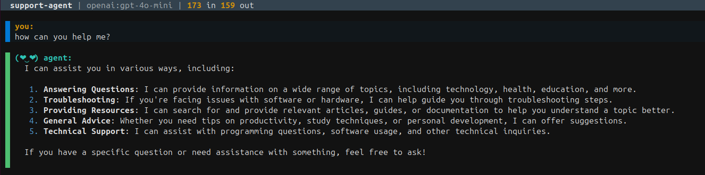
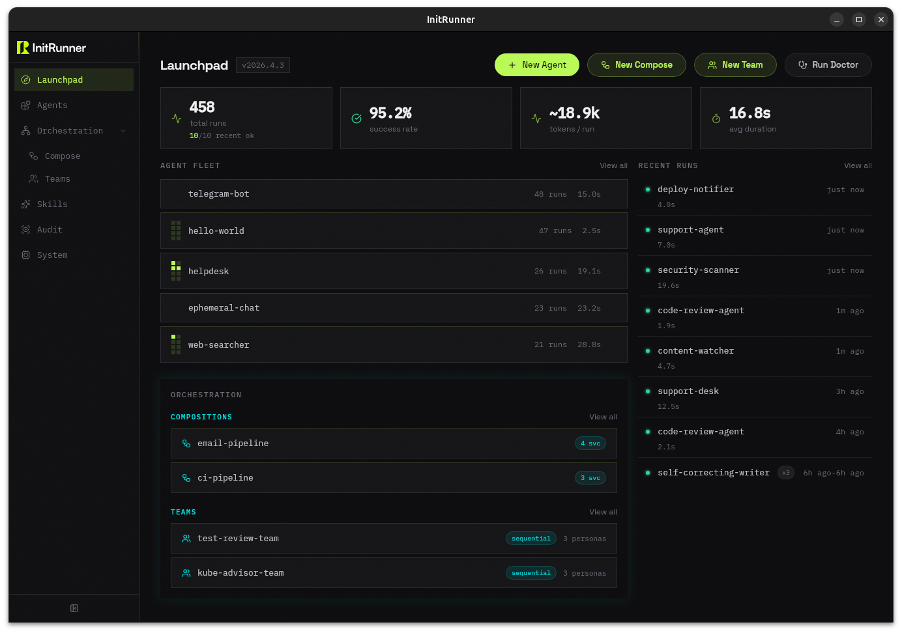
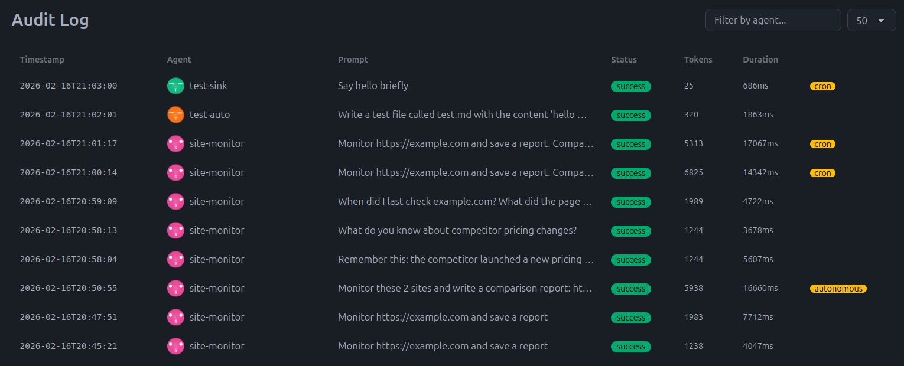

# InitRunner — AI Agent Roles as YAML

<p align="center"></p>

<p align="center">
  
  <a href="https://pypi.org/project/initrunner/"></a>
  <a href="https://github.com/vladkesler/initrunner"></a>
  <a href="https://hub.docker.com/r/vladkesler/initrunner"></a>
  <a href="LICENSE"></a>
  <a href="tests/"></a>
  <a href="https://github.com/astral-sh/ruff"></a>
  <a href="https://ai.pydantic.dev/"></a>
  <a href="https://initrunner.ai/"></a>
</p>

<p align="center">
  <a href="https://initrunner.ai/">Website</a> · <a href="https://initrunner.ai/docs">Docs</a> · <a href="https://github.com/vladkesler/initrunner/issues">Issues</a>
</p>

**Define AI agent roles in YAML and run them anywhere — CLI, API server, or autonomous daemon.**

Your agent is a YAML file. Its tools, knowledge base, memory, triggers, and multimodal input — all config, not code. Deploy it as a CLI tool, a cron-driven daemon, or an OpenAI-compatible API. Compose agents into pipelines. RAG and long-term memory come batteries-included. Manage, chat, and audit from a web dashboard or terminal TUI.

> **v1.1.5** — Stable release. See the [Changelog](CHANGELOG.md) for details.

## Table of Contents

- [See It in Action](#see-it-in-action)
- [Why InitRunner](#why-initrunner)
- [From Simple to Powerful](#from-simple-to-powerful)
- [Community Roles](#community-roles)
- [Install & Quickstart](#install--quickstart)
- [Docker](#docker)
- [Core Concepts](#core-concepts)
- [CLI Quick Reference](#cli-quick-reference)
- [User Interfaces](#user-interfaces)
- [Documentation](#documentation)
- [Examples](#examples)
- [Community & Support](#community--support)
- [Contributing](#contributing)
- [License](#license)

## See It in Action

A code reviewer that can read your files and inspect git history — one YAML file:

```yaml
apiVersion: initrunner/v1
kind: Agent
metadata:
  name: code-reviewer
  description: Reviews code for bugs and style issues
spec:
  role: |
    You are a senior engineer. Review code for correctness and readability.
    Use git tools to examine changes and read files for context.
  model: { provider: openai, name: gpt-5-mini }
  tools:
    - type: git
      repo_path: .
    - type: filesystem
      root_path: .
      read_only: true
```

```bash
initrunner run reviewer.yaml -p "Review the latest commit"
```

That's it. No Python, no boilerplate.

Using Claude? Install the Anthropic extra and swap the model line:

```bash
pip install "initrunner[anthropic]"
```

```yaml
model: { provider: anthropic, name: claude-opus-4-6 }
```

The same file also runs as an interactive chat (`-i`), a trigger-driven daemon, or an OpenAI-compatible API server.

<p align="center">
  <br>
  <em>Interactive REPL — chat with any agent from the terminal</em>
</p>

## Why InitRunner

**Config, not code** — Define your agent's tools, knowledge base, and memory in one YAML file. No framework boilerplate, no wiring classes together. 16 built-in tools (filesystem, git, HTTP, Python, shell, SQL, search, email, MCP, and more) work out of the box. Need a custom tool? One file, one decorator.

**Version-control your agents** — Agent configs are plain text. Diff them, review them in PRs, validate in CI, reproduce anywhere. Your agent definition lives next to your code.

**Prototype to production** — Same YAML runs as an interactive chat, a one-shot CLI command, a trigger-driven daemon, or an OpenAI-compatible API. No rewrite when you're ready to deploy.

## From Simple to Powerful

Start with the code-reviewer above. Each step adds one capability — no rewrites, just add a section to your YAML.

### 1. Add knowledge & memory

Point at your docs for RAG — a `search_documents` tool is auto-registered. Add `memory` for persistent recall across sessions:

```yaml
spec:
  ingest:
    sources: ["./docs/**/*.md", "./docs/**/*.pdf"]
  memory:
    store_path: ./memory.db
    max_memories: 1000
```

```bash
initrunner ingest role.yaml   # extract | chunk | embed | store
initrunner run role.yaml -i --resume   # search_documents + memory ready
```

### 2. Add skills

Compose reusable bundles of tools and prompts. Each skill is a `SKILL.md` file — reference it by path:

```yaml
spec:
  skills:
    - ../skills/web-researcher
    - ../skills/code-tools.md
```

The agent inherits each skill's tools and prompt instructions automatically.

A `SKILL.md` file has a YAML frontmatter block defining the tools it provides, followed by markdown guidelines the agent will follow:

```markdown
---
name: my-skill
description: What this skill does
tools:
  - type: web_reader
    timeout_seconds: 15
  - type: search
---
Use the web_reader tool to fetch pages as markdown before answering.
Cite URLs in your responses.
```

Run `initrunner init --skill my-skill` to scaffold one.

### 3. Add triggers

Turn it into a daemon that reacts to events:

```yaml
spec:
  triggers:
    - type: cron
      schedule: "0 9 * * 1"
      prompt: "Generate the weekly status report."
    - type: file_watch
      paths: [./src]
      prompt_template: "File changed: {path}. Review it."
```

```bash
initrunner daemon role.yaml   # runs until stopped
```

### 4. Compose agents

Orchestrate multiple agents into a pipeline. One agent's output feeds into the next:

```yaml
apiVersion: initrunner/v1
kind: Compose
metadata:
  name: email-pipeline
  description: Multi-agent email processing pipeline
spec:
  services:
    inbox-watcher:
      role: roles/inbox-watcher.yaml
      sink: { type: delegate, target: triager }
    triager:
      role: roles/triager.yaml
```

```bash
initrunner compose up pipeline.yaml
```

### 5. Serve as an API

Turn any agent into an OpenAI-compatible endpoint. Drop-in for Open WebUI, Vercel AI SDK, or any OpenAI-compatible client:

```bash
initrunner serve support-agent.yaml --port 3000
```

```python
from openai import OpenAI

client = OpenAI(base_url="http://localhost:3000/v1", api_key="unused")
response = client.chat.completions.create(
    model="support-agent",
    messages=[{"role": "user", "content": "How do I reset my password?"}],
)
```

Or connect [Open WebUI](https://github.com/open-webui/open-webui) for a full chat interface:

```bash
docker run -d --name open-webui --network host \
  -e OPENAI_API_BASE_URL=http://127.0.0.1:3000/v1 \
  -e OPENAI_API_KEY=unused \
  -v open-webui:/app/backend/data \
  ghcr.io/open-webui/open-webui:main
# Open http://localhost:8080 and select the support-agent model
```

See [Server docs](docs/interfaces/server.md#open-webui-integration) for the full walkthrough.

### 6. Attach files and media

Send images, audio, video, and documents alongside your prompts — from the CLI, REPL, API, or dashboard:

```bash
# Attach an image to a prompt
initrunner run role.yaml -p "Describe this image" -A photo.png

# Multiple attachments
initrunner run role.yaml -p "Compare these" -A before.png -A after.png

# URL attachment
initrunner run role.yaml -p "What's in this image?" -A https://example.com/photo.jpg
```

In the interactive REPL, use `/attach` to queue files:

```
> /attach diagram.png
Queued attachment: diagram.png
> /attach notes.pdf
Queued attachment: notes.pdf
> What do these show?
[assistant response with both attachments]
```

The API server accepts multimodal content in the standard OpenAI format. See [Multimodal Input](docs/core/multimodal.md) for the full reference.

### 7. Get structured output

Force the agent to return validated JSON matching a schema — ideal for pipelines and automation:

```yaml
spec:
  output:
    type: json_schema
    schema:
      type: object
      properties:
        status:
          type: string
          enum: [approved, rejected, needs_review]
        amount:
          type: number
        vendor:
          type: string
      required: [status, amount, vendor]
```

```bash
initrunner run classifier.yaml -p "Acme Corp invoice for $250"
# → {"status": "approved", "amount": 250.0, "vendor": "Acme Corp"}
```

See [Structured Output](docs/core/structured-output.md) for inline schemas, external schema files, and pipeline integration.

## Community Roles

Browse, install, and run roles shared by the community — no copy-paste needed:

```bash
initrunner search "code review"       # browse the community index
initrunner install code-reviewer      # download, validate, confirm
initrunner run ~/.initrunner/roles/code-reviewer.yaml -i
```

Install directly from any GitHub repo:

```bash
initrunner install user/repo:roles/support-agent.yaml@v1.0
```

Every install shows a security summary (tools, model, author) and asks for confirmation before saving. See [docs/agents/registry.md](docs/agents/registry.md) for source formats, the community index, and update workflows.

## Install & Quickstart

**1. Install**

```bash
curl -fsSL https://initrunner.ai/install.sh | sh
```

Or with a package manager:

```bash
pip install initrunner
# or
uv tool install initrunner
# or
pipx install initrunner
```

Common extras:

| Extra | What it adds |
|-------|--------------|
| `initrunner[anthropic]` | Anthropic provider (Claude) |
| `initrunner[ingest]` | PDF, DOCX, XLSX ingestion |
| `initrunner[dashboard]` | FastAPI web dashboard (HTMX + DaisyUI) |
| `initrunner[search]` | Web search (DuckDuckGo) |

See [docs/getting-started/installation.md](docs/getting-started/installation.md) for the full extras table, dev setup, and environment configuration.

**2. Set your API key**

Before running an agent, set your provider API key:

```bash
export OPENAI_API_KEY=sk-...          # OpenAI (default)
export ANTHROPIC_API_KEY=sk-ant-...   # Claude (requires initrunner[anthropic])
```

`initrunner setup` walks through this interactively and stores the key in your shell profile.

**3. Create your first agent and run it**

The fastest way to get started — `setup` walks you through provider, API key, model, and agent creation in one step:

```bash
initrunner setup                # guided wizard — picks provider, stores API key, creates a role
initrunner run my-agent.yaml -p "Hello!"   # single-shot prompt
initrunner run my-agent.yaml -i            # interactive chat
```

There are several ways to create a role — pick whichever fits:

| Method | Command | Best for |
|--------|---------|----------|
| Copy an example | `initrunner examples list` then `initrunner examples copy <name>` | Complete, working agents ready to run ([docs](docs/getting-started/cli.md)) |
| Guided wizard | `initrunner setup` | First-time setup ([docs](docs/getting-started/setup.md)) |
| Interactive scaffold | `initrunner init -i` | Prompted step-by-step creation ([docs](docs/getting-started/cli.md)) |
| AI generation | `initrunner create "code reviewer for Python"` | Describe what you want in natural language ([docs](docs/agents/role_generation.md)) |
| CLI flags | `initrunner init --name my-agent --model gpt-5-mini` | Quick one-liner ([docs](docs/getting-started/cli.md)) |
| Manual YAML | Copy the [example above](#see-it-in-action) | Full control |

See the hands-on [Tutorial](docs/getting-started/tutorial.md) for a complete walkthrough.

## Docker

Run InitRunner without installing Python — just Docker:

Before running, create a `./roles/` directory and add a role YAML file — the examples below reference it as `/roles/my-agent.yaml`. No role yet? Run `initrunner examples copy hello-world` if you have InitRunner installed, or copy [hello-world.yaml](examples/roles/hello-world.yaml) from this repo.

```bash
# One-shot prompt
docker run --rm -e OPENAI_API_KEY \
    -v ./roles:/roles ghcr.io/vladkesler/initrunner:latest \
    run /roles/my-agent.yaml -p "Hello"

# Interactive chat
docker run --rm -it -e OPENAI_API_KEY \
    -v ./roles:/roles ghcr.io/vladkesler/initrunner:latest \
    run /roles/my-agent.yaml -i

# Web dashboard — open http://localhost:8420 after starting
docker run -d -e OPENAI_API_KEY \
    -v ./roles:/roles \
    -v initrunner-data:/data \
    -p 8420:8420 ghcr.io/vladkesler/initrunner:latest \
    ui --role-dir /roles
# ./roles          — your local role files (mounted read/write into /roles)
# initrunner-data  — named volume: audit log, embeddings, memory (persists across restarts)
```

`-e OPENAI_API_KEY` forwards the variable from your current shell — make sure it's exported first (`export OPENAI_API_KEY=sk-...`). Prefer a file? Copy `examples/.env.example` to `.env`, fill in your key, and replace `-e OPENAI_API_KEY` with `--env-file .env`.

The image is also available on Docker Hub: `vladkesler/initrunner`

Or use the included `docker-compose.yml` to start the dashboard with persistent storage:

```bash
# Copy examples/.env.example → .env, add your key, then:
docker compose up
# Dashboard is now at http://localhost:8420
```

Build the image locally:

```bash
docker build -t initrunner .
docker run --rm initrunner --version
```

The default image includes dashboard, ingestion, all model providers, and safety extras. Override with `--build-arg EXTRAS="dashboard,anthropic"` to customize.

Using Ollama on the host? Set the model endpoint to `http://host.docker.internal:11434/v1` in your role YAML.

## Core Concepts

<p align="center">
  <br>
  <em>Web dashboard — create and manage roles with a live YAML preview</em>
</p>

### Role files

Every agent is a YAML file with four top-level keys:

```yaml
apiVersion: initrunner/v1
kind: Agent
metadata:
  name: my-agent
  description: What this agent does
spec:
  role: "System prompt goes here."
  model: { provider: openai, name: gpt-5-mini }
  tools: [...]
  guardrails:
    max_tool_calls: 20
    timeout_seconds: 300
    max_tokens_per_run: 50000
    autonomous_token_budget: 200000
```

Validate with `initrunner validate role.yaml` or scaffold one with `initrunner init --name my-agent --model gpt-5-mini`.

`metadata.tags` are used by intent sensing (`--sense`) and community search. Specific, task-oriented tags improve role selection:

```yaml
metadata:
  name: web-searcher
  description: Research assistant that searches the web
  tags: [search, web, research, summarize, browse]
```

### Tools

Tools give your agent capabilities beyond text generation. Configure them in `spec.tools`.

#### Built-in tools

| Type | What it does |
|------|-------------|
| `filesystem` | Read/write files within a root directory |
| `git` | Git log, diff, blame, show (read-only by default) |
| `shell` | Run shell commands with allowlist/blocklist |
| `python` | Run Python in an isolated subprocess |
| `sql` | Query SQLite databases (read-only by default) |
| `http` | HTTP requests to a base URL |
| `web_reader` | Fetch web pages and convert to markdown |
| `web_scraper` | Scrape, chunk, embed, and store web pages |
| `search` | Web and news search (DuckDuckGo, SerpAPI, Brave, Tavily) |
| `email` | Search, read, and send email via IMAP/SMTP |
| `slack` | Send messages to Slack channels |
| `api` | Declarative REST API endpoints from YAML |
| `datetime` | Get current time and parse dates |
| `mcp` | Connect to MCP servers (stdio, SSE, streamable-http) |
| `delegate` | Hand off to other agents |
| `custom` | Load tool functions from external Python modules |

See [docs/agents/tools.md](docs/agents/tools.md) for the full reference.

#### Custom tools

Add a built-in tool by creating a single file in `initrunner/agent/tools/` with a config class and a `@register_tool` decorated builder function — it's auto-discovered and immediately available in role YAML. Alternatively, load your own Python functions with `type: custom` and a `module` path pointing to any importable module. See [docs/agents/tool_creation.md](docs/agents/tool_creation.md) for the full guide.

#### Plugin registry

Third-party packages can register new tool types via the `initrunner.tools` entry point. Once installed (`pip install initrunner-<name>`), the tool type is available in YAML like any built-in. Run `initrunner plugins` to list discovered plugins. See the [plugin section of the tool creation guide](docs/agents/tool_creation.md) for details.

### Run modes

| Mode | Command | Use case |
|------|---------|----------|
| Single-shot | `initrunner run role.yaml -p "prompt"` | One question, one answer |
| Interactive | `initrunner run role.yaml -i` | Multi-turn chat (REPL) |
| Autonomous | `initrunner run role.yaml -p "prompt" -a` | Multi-step agentic loop with self-reflection |
| **Intent Sensing** | `initrunner run --sense -p "prompt"` | Pick the best role automatically from discovered roles |
| Daemon | `initrunner daemon role.yaml` | Trigger-driven (cron, file watch, webhook) |
| API server | `initrunner serve role.yaml` | OpenAI-compatible HTTP API |

#### Intent Sensing options

| Flag | Description |
|------|-------------|
| `--sense` | Sense the best role for the given prompt |
| `--role-dir PATH` | Directory to search for roles (used with `--sense`) |
| `--confirm-role` | Confirm the sensed role before running |

Without `--role-dir`, roles are discovered from the current directory (`.`), `./examples/roles/`, and `~/.config/initrunner/roles/` (the global roles directory).

See [Intent Sensing](docs/core/intent_sensing.md) for algorithm details, role tagging tips, and troubleshooting.

### Guardrails

Control costs and runaway agents with `spec.guardrails`:

| Setting | Default | Scope |
|---------|---------|-------|
| `max_tokens_per_run` | 50 000 | Output tokens per single LLM call |
| `max_tool_calls` | 20 | Tool invocations per run |
| `timeout_seconds` | 300 | Wall-clock timeout per run |
| `autonomous_token_budget` | — | Total tokens across all autonomous iterations |
| `session_token_budget` | — | Cumulative limit for an interactive session |
| `daemon_daily_token_budget` | — | Daily token cap for daemon mode |

When any limit is reached the run stops immediately and raises an error. In autonomous mode, the partial result up to that point is returned.

See [Guardrails](docs/configuration/guardrails.md) and [Token Control](docs/configuration/token_control.md) for the full reference.

<p align="center">
  <br>
  <em>Audit log — track every agent run with tokens, duration, and trigger mode</em>
</p>

For RAG, memory, triggers, compose, and skills see [From Simple to Powerful](#from-simple-to-powerful) above. Full references: [Ingestion](docs/core/ingestion.md) · [Memory](docs/core/memory.md) · [Triggers](docs/core/triggers.md) · [Compose](docs/orchestration/agent_composer.md) · [Skills](docs/agents/skills_feature.md) · [Providers](docs/configuration/providers.md)

## CLI Quick Reference

| Command | Description |
|---------|-------------|
| `run <role.yaml> -p "..."` | Single-shot prompt |
| `run <role.yaml> -i` | Interactive REPL |
| `run <role.yaml> -p "..." -a` | Autonomous agentic loop |
| `run <role.yaml> -p "..." -a --max-iterations N` | Autonomous with iteration limit |
| `run --sense -p "..."` | Sense best role and run |
| `run --sense --role-dir PATH -p "..."` | Sense best role from a specific directory |
| `run --sense --confirm-role -p "..."` | Sense best role with confirmation prompt |
| `validate <role.yaml>` | Validate a role definition |
| `init --name <name> [--model <model>]` | Scaffold a new role from CLI flags |
| `init -i` | Interactive role-creation wizard |
| `create "<description>"` | AI-generate a role from a description |
| `setup` | Guided provider + API key + role setup |
| `ingest <role.yaml>` | Ingest documents into vector store |
| `daemon <role.yaml>` | Run in trigger-driven daemon mode |
| `run <role.yaml> -p "..." -A file.png` | Attach files or URLs to prompt |
| `run <role.yaml> -p "..." --export-report` | Export a markdown report after the run |
| `doctor` | Check provider config, API keys, connectivity |
| `doctor --quickstart` | End-to-end smoke test with a real API call |
| `serve <role.yaml>` | Serve as OpenAI-compatible API |
| `tui` | Launch terminal dashboard |
| `ui` | Launch web dashboard |
| `compose up <compose.yaml>` | Run multi-agent orchestration |
| `install <source>` | Install a community role from GitHub |
| `uninstall <name>` | Remove an installed role |
| `search <query>` | Search the community role index |
| `info <source>` | Inspect a role before installing |
| `list` | Show installed roles |
| `update [name] / --all` | Update installed roles |

See [docs/getting-started/cli.md](docs/getting-started/cli.md) for the full command list and all options.

## User Interfaces

Beyond the CLI, InitRunner includes a terminal UI and a web dashboard for visual agent management.

| | Terminal UI (`tui`) | Web Dashboard (`ui`) |
|---|---|---|
| **Launch** | `initrunner tui` | `initrunner ui` |
| **Install** | `pip install initrunner[tui]` | `pip install initrunner[dashboard]` |
| **Chat** | Streaming chat with token counts | SSE streaming chat with file attachments |
| **Audit** | Browse & filter audit records | Audit log with detail panel |
| **Memory** | View, export, delete memories | View, filter, export, clear memories |
| **Daemon** | Real-time trigger event log | WebSocket trigger monitor |
| **Style** | k9s-style keyboard-driven (Textual) | Server-rendered HTML (HTMX + DaisyUI) |

See [TUI docs](docs/interfaces/tui.md) · [Dashboard docs](docs/interfaces/dashboard.md) · [API Server docs](docs/interfaces/server.md)

## Documentation

| Area | Key docs |
|------|----------|
| Getting started | [Installation](docs/getting-started/installation.md) · [Setup](docs/getting-started/setup.md) · [RAG Quickstart](docs/getting-started/rag-quickstart.md) · [Tutorial](docs/getting-started/tutorial.md) · [CLI Reference](docs/getting-started/cli.md) |
| Agents & tools | [Tools](docs/agents/tools.md) · [Tool Creation](docs/agents/tool_creation.md) · [Skills](docs/agents/skills_feature.md) · [Structured Output](docs/core/structured-output.md) · [Providers](docs/configuration/providers.md) |
| Knowledge & memory | [Ingestion](docs/core/ingestion.md) · [Memory](docs/core/memory.md) · [Multimodal Input](docs/core/multimodal.md) |
| Orchestration | [Compose](docs/orchestration/agent_composer.md) · [Delegation](docs/orchestration/delegation.md) · [Autonomy](docs/orchestration/autonomy.md) · [Triggers](docs/core/triggers.md) · [Intent Sensing](docs/core/intent_sensing.md) |
| Interfaces | [Dashboard](docs/interfaces/dashboard.md) · [TUI](docs/interfaces/tui.md) · [API Server](docs/interfaces/server.md) |
| Operations | [Security](docs/security/security.md) · [Guardrails](docs/configuration/guardrails.md) · [Audit](docs/core/audit.md) · [Reports](docs/core/reports.md) · [Doctor](docs/operations/doctor.md) · [Observability](docs/core/observability.md) · [CI/CD](docs/operations/cicd.md) |

See [`docs/`](docs/) for the full index.

## Examples

Browse and copy any example locally:

```bash
initrunner examples list              # see all available examples
initrunner examples copy code-reviewer   # copy to current directory
```

The `examples/` directory includes 20+ ready-to-run agents, skills, and compose pipelines covering real-world scenarios:

**Role definitions** (`examples/roles/`) — single-agent configs for support bots, code reviewers, changelog generators, deploy notifiers, web monitors, data analysts, and more.

**Skills** (`examples/skills/`) — reusable capability bundles:
- `web-researcher/` — web research tools (fetch pages, HTTP requests)
- `code-tools.md` — code execution and file browsing tools

See `examples/roles/skill-demo.yaml` for a role composing multiple skills.

**Compose pipelines** (`examples/compose/`) — multi-agent orchestration:
- `email-pipeline/` — cron-driven email triage with fan-out to researcher and responder
- `content-pipeline/` — file-watch-driven content creation with `process_existing` startup scan
- `ci-pipeline/` — webhook-driven CI build analysis with notifications

## Community & Support

- [GitHub Issues](https://github.com/vladkesler/initrunner/issues) — Bug reports and feature requests
- [Changelog](CHANGELOG.md) — Release notes and version history

If you find InitRunner useful, consider giving it a star — it helps others discover the project.

## Contributing

Contributions welcome! See [CONTRIBUTING.md](CONTRIBUTING.md) for dev setup, PR guidelines, and quality checks.

### Share a role

Push your `role.yaml` to a public GitHub repo — anyone can install it with `initrunner install user/repo`. To list it in the community index so users can `initrunner install my-role` by name, open a PR to [vladkesler/community-roles](https://github.com/vladkesler/community-roles) adding an entry to `index.yaml`. See [docs/agents/registry.md](docs/agents/registry.md) for details.

For security vulnerabilities, please see [SECURITY.md](SECURITY.md).

## License

MIT — see [LICENSE](LICENSE) for details.
