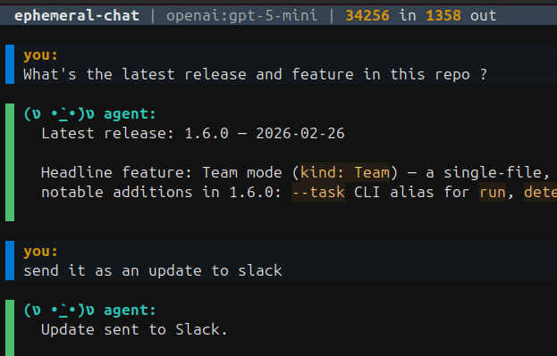

# InitRunner

<p align="center"></p>

<p align="center">
  
  <a href="https://pypi.org/project/initrunner/"></a>
  <a href="https://pypi.org/project/initrunner/"></a>
  <a href="https://github.com/vladkesler/initrunner"></a>
  <a href="https://hub.docker.com/r/vladkesler/initrunner"></a>
  <a href="LICENSE"></a>
  <a href="tests/"></a>
  
  <a href="https://github.com/astral-sh/ruff"></a>
  <a href="https://ai.pydantic.dev/"></a>
  <a href="https://initrunner.ai/"></a>
  <a href="https://discord.gg/GRTZmVcW"></a>
</p>

<p align="center">
  <a href="https://initrunner.ai/">Website</a> · <a href="https://initrunner.ai/docs">Docs</a> · <a href="https://hub.initrunner.ai/">InitHub</a> · <a href="https://discord.gg/GRTZmVcW">Discord</a> · <a href="https://github.com/vladkesler/initrunner/issues">Issues</a>
</p>

**Define AI agents in YAML. Run them as CLI tools, Telegram bots, Discord bots, API servers, or autonomous daemons. Built-in RAG, persistent memory, 40+ tools, policy-based authorization. Any model.**

One YAML file is all it takes to go from idea to running agent - with document search, persistent memory, and tools wired in automatically. Start with `initrunner chat` for a zero-config assistant, then scale to bots, pipelines, and API servers without rewriting anything.

> **v1.37.0** - `initrunner configure` command to switch providers without editing YAML. Post-install provider adaptation detects mismatched API keys and offers one-step switching. PydanticAI 1.70.0+. See the [Changelog](CHANGELOG.md).

## Contents

- [Quickstart](#quickstart)
- [Define an Agent in YAML](#define-agent-roles-in-yaml)
- [User Interfaces](#user-interfaces)
- [Why InitRunner](#why-initrunner)
- [Features](#features)
- [Security & Authorization](#security--authorization)
- [Distribution & Deployment](#distribution--deployment)
- [Documentation](#documentation)
- [Community](#community--contributing)

## Quickstart

```bash
curl -fsSL https://initrunner.ai/install.sh | sh -s -- --extras all
initrunner setup        # wizard: pick provider, model, API key
initrunner new "a research assistant that summarizes papers"  # build an agent
initrunner chat --ingest ./docs/   # chat with your docs, memory on by default
```

Or install with a package manager: `uv tool install "initrunner[all]"` / `pipx install "initrunner[all]"`. See [Installation](docs/getting-started/installation.md), [Setup](docs/getting-started/setup.md), and [Chat](docs/getting-started/chat.md) for details.

**Or run with Docker**, no install needed:

```bash
docker run --rm -it -e OPENAI_API_KEY \
    -v initrunner-data:/data ghcr.io/vladkesler/initrunner:latest chat
```

See the [Docker guide](docs/getting-started/docker.md) for RAG, Telegram, API server, and more examples.

## Define Agent Roles in YAML

When you need more control, define an agent as a YAML file:

```yaml
apiVersion: initrunner/v1
kind: Agent
metadata:
  name: code-reviewer
  description: Reviews code for bugs and style issues
spec:
  role: |
    You are a senior engineer. Review code for correctness and readability.
    Use git tools to examine changes and read files for context.
  model: { provider: openai, name: gpt-5-mini }
  tools:
    - type: git
      repo_path: .
    - type: filesystem
      root_path: .
      read_only: true
```

```bash
initrunner run reviewer.yaml -p "Review the latest commit"
```

That's it. No Python, no boilerplate. Using Claude? `pipx install "initrunner[anthropic]"` and set `model: { provider: anthropic, name: claude-opus-4-6 }`.

<p align="center">
  <br>
  <em>Quick Chat - ask a question, send the answer to Slack</em>
</p>

## User Interfaces

| | Terminal UI (`tui`) | Web Dashboard (`ui`) |
|---|---|---|
| **Launch** | `initrunner tui` | `initrunner ui` |
| **Install** | `pip install initrunner[tui]` | `pip install initrunner[dashboard]` |
| **Roles** | Create from template, edit via forms | Form builder with live preview, AI generate |
| **Chat** | Streaming chat with token counts | SSE streaming with file attachments |
| **Extras** | Audit log, memory, daemon event log | Audit detail panel, memory, trigger monitor |
| **Style** | k9s-style keyboard-driven (Textual) | Server-rendered HTML (HTMX + DaisyUI) |

See [TUI docs](docs/interfaces/tui.md) · [Dashboard docs](docs/interfaces/dashboard.md) · [API Server docs](docs/interfaces/server.md)

## Why InitRunner

**Zero config to start.** `initrunner chat` gives you an AI assistant with persistent memory and document search out of the box. No YAML, no setup beyond an API key.

**Config, not code.** Define your agent's tools, knowledge base, and memory in one YAML file. No framework boilerplate, no wiring classes together. 20+ built-in tools (filesystem, git, HTTP, Python, shell, SQL, search, email, MCP, think, script, and more) work out of the box. Need a custom tool? One file, one decorator.

**Version-control your agents.** Agent configs are plain text. Diff them, review them in PRs, validate in CI, reproduce anywhere. Your agent definition lives next to your code.

**Prototype to production.** Same YAML runs as an interactive chat, a one-shot CLI command, a trigger-driven daemon, or an OpenAI-compatible API. No rewrite when you're ready to deploy.

## How It Compares

|  | InitRunner | Build from scratch | LangChain |
|---|---|---|---|
| **Setup** | `curl -fsSL https://initrunner.ai/install.sh \| sh` + API key | Install 5-10 packages, write glue code | `pip install langchain` + adapters |
| **Agent config** | One YAML file | Python classes + wiring | Python chains + config objects |
| **RAG** | `--ingest ./docs/` (one flag) | Embed, store, retrieve, prompt - DIY | Loaders > splitters > vectorstore chain |
| **Bot deployment** | `--telegram` / `--discord` flag | Build bot framework integration | Separate bot framework + adapter |
| **Model switching** | `--model` flag, aliases, or change YAML | Rewrite client code | Swap LLM class + adjust prompts |
| **Multi-agent** | `compose.yaml` with delegation + auto-routing | Custom orchestration layer | Agent executor + custom routing |

## What Can You Build?

- **A Telegram bot that answers questions about your codebase** - point it at your repo, deploy with one flag
- **A cron job that monitors competitors and sends daily digests** - cron trigger + web scraper + Slack sink
- **A document Q&A agent for your team's knowledge base** - ingest PDFs and Markdown, serve as an API
- **A code review bot triggered by new commits** - file-watch trigger + git tools + structured output
- **A multi-agent pipeline with auto-routing: intake > researcher / responder / escalator** - sense routing picks the right target per message (`initrunner examples copy support-desk`)
- **A personal assistant that remembers everything** - persistent memory across sessions, no setup

## Features

Start with the code-reviewer above. Each step adds one capability - no rewrites, just add a section to your YAML.

### Knowledge & memory

Point at your docs for RAG - a `search_documents` tool is auto-registered. Add `memory` for persistent recall across sessions:

```yaml
spec:
  ingest:
    sources: ["./docs/**/*.md", "./docs/**/*.pdf"]
  memory:
    store_path: ./memory.db
    semantic:
      max_memories: 1000
```

```bash
initrunner ingest role.yaml   # extract | chunk | embed | store
initrunner run role.yaml -i --resume   # search_documents + memory ready
```

See [Ingestion](docs/core/ingestion.md) · [Memory](docs/core/memory.md) · [RAG Quickstart](docs/getting-started/rag-quickstart.md).

### Triggers

Turn it into a daemon that reacts to events - cron, file watch, webhook, heartbeat, Telegram, or Discord:

```yaml
spec:
  triggers:
    - type: cron
      schedule: "0 9 * * 1"
      prompt: "Generate the weekly status report."
    - type: file_watch
      paths: [./src]
      prompt_template: "File changed: {path}. Review it."
```

```bash
initrunner run role.yaml --daemon   # runs until stopped
```

See [Triggers](docs/core/triggers.md) · [Telegram](docs/getting-started/telegram.md) · [Discord](docs/getting-started/discord.md).

### Compose agents

Orchestrate multiple agents into a pipeline - one agent's output feeds into the next. Use `strategy: sense` to auto-route messages to the right target:

```yaml
apiVersion: initrunner/v1
kind: Compose
metadata: { name: email-pipeline }
spec:
  services:
    inbox-watcher:
      role: roles/inbox-watcher.yaml
      sink: { type: delegate, target: triager }
    triager:
      role: roles/triager.yaml
      sink: { type: delegate, strategy: sense, target: [researcher, responder] }
    researcher: { role: roles/researcher.yaml }
    responder: { role: roles/responder.yaml }
```

Run with `initrunner compose up pipeline.yaml`. See [Compose](docs/orchestration/agent_composer.md) · [Delegation](docs/orchestration/delegation.md).

## Security & Authorization

Built-in security with optional [Cerbos](https://github.com/cerbos/cerbos) agent-as-principal policy engine. Agents get Cerbos identity from `role.metadata` (name, team, tags, author), with **tool-level authorization** and **delegation policy** enforced across CLI, compose, daemon, API, and pipeline:

```bash
pip install initrunner[authz]
export INITRUNNER_CERBOS_ENABLED=true
export INITRUNNER_CERBOS_AGENT_CHECKS=true  # per-agent identity checks
initrunner run role.yaml   # tool calls + delegation checked against Cerbos policies
```

Also includes content filtering, PEP 578 sandboxing, Docker isolation, token budgets, and rate limiting out of the box. See [Agent Policy](docs/security/agent-policy.md) · [Security](docs/security/security.md) · [Guardrails](docs/configuration/guardrails.md).

### More capabilities

| Feature | Command / config | Docs |
|---------|-----------------|------|
| **Skills** - reusable tool + prompt bundles, auto-discovered | `spec: { skills: [../skills/web-researcher] }` | [Skills](docs/agents/skills_feature.md) |
| **Team mode** - multi-persona on one task | `kind: Team` + `spec: { personas: {…} }` | [Team Mode](docs/orchestration/team_mode.md) |
| **API server** - OpenAI-compatible endpoint | `initrunner run agent.yaml --serve --port 3000` | [Server](docs/interfaces/server.md) |
| **Multimodal** - images, audio, video, docs | `initrunner run role.yaml -p "Describe" -A photo.png` | [Multimodal](docs/core/multimodal.md) |
| **Structured output** - validated JSON schemas | `spec: { output: { schema: {…} } }` | [Structured Output](docs/core/structured-output.md) |
| **Evals** - test agent output quality | `initrunner test role.yaml -s eval.yaml` | [Evals](docs/core/evals.md) |
| **MCP gateway** - expose agents as MCP tools | `initrunner mcp serve agent.yaml` | [MCP Gateway](docs/interfaces/mcp-gateway.md) |
| **MCP toolkit** - tools without an agent | `initrunner mcp toolkit` | [MCP Gateway](docs/interfaces/mcp-gateway.md) |
| **Configure** - switch provider/model on any role | `initrunner configure role.yaml --provider groq` | [Providers](docs/configuration/providers.md) |

See [Tutorial](docs/getting-started/tutorial.md) for a guided walkthrough.

## Distribution & Deployment

### InitHub

```bash
initrunner search "code review"                          # browse InitHub
initrunner install alice/code-reviewer                   # install from InitHub
initrunner install alice/code-reviewer@1.2.0             # pin a version
```

See [Registry](docs/agents/registry.md).

```bash
initrunner login                        # browser-based device code auth
initrunner login --token <TOKEN>        # CI/headless
initrunner publish                      # publish from current agent directory
```

See [Publishing Guide](https://hub.initrunner.ai/docs/publish).

### OCI registry

Publish and install complete role bundles to any OCI-compliant container registry:

```bash
initrunner publish oci://ghcr.io/org/my-agent --tag 1.0.0       # from current dir
initrunner publish ./my-agent/ oci://ghcr.io/org/my-agent --tag 1.0.0  # or pass a path
initrunner install oci://ghcr.io/org/my-agent:1.0.0
```

See [OCI Distribution](docs/core/oci-distribution.md).

### Cloud deploy

[](https://railway.com/template/FROM_REPO?referralCode=...)
[](https://render.com/deploy?repo=https://github.com/vladkesler/initrunner)

**Fly.io:** See [Cloud Deployment Guide](docs/getting-started/cloud-deploy.md#deploy-to-flyio).

## Documentation

| Area | Key docs |
|------|----------|
| Getting started | [Installation](docs/getting-started/installation.md) · [Setup](docs/getting-started/setup.md) · [Chat](docs/getting-started/chat.md) · [RAG Quickstart](docs/getting-started/rag-quickstart.md) · [Tutorial](docs/getting-started/tutorial.md) · [CLI Reference](docs/getting-started/cli.md) · [Docker](docs/getting-started/docker.md) · [Discord Bot](docs/getting-started/discord.md) · [Telegram Bot](docs/getting-started/telegram.md) |
| Agents & tools | [Tools](docs/agents/tools.md) · [Tool Creation](docs/agents/tool_creation.md) · [Tool Search](docs/core/tool-search.md) · [Skills](docs/agents/skills_feature.md) · [Structured Output](docs/core/structured-output.md) · [Providers](docs/configuration/providers.md) |
| Knowledge & memory | [Ingestion](docs/core/ingestion.md) · [Memory](docs/core/memory.md) · [Multimodal Input](docs/core/multimodal.md) |
| Orchestration | [Compose](docs/orchestration/agent_composer.md) · [Delegation](docs/orchestration/delegation.md) · [Team Mode](docs/orchestration/team_mode.md) · [Autonomy](docs/orchestration/autonomy.md) · [Triggers](docs/core/triggers.md) · [Intent Sensing](docs/core/intent_sensing.md) |
| Interfaces | [Dashboard](docs/interfaces/dashboard.md) · [TUI](docs/interfaces/tui.md) · [API Server](docs/interfaces/server.md) · [MCP Gateway](docs/interfaces/mcp-gateway.md) |
| Distribution | [OCI Distribution](docs/core/oci-distribution.md) · [Shareable Templates](docs/getting-started/shareable-templates.md) |
| Operations | [Security](docs/security/security.md) · [Agent Policy](docs/security/agent-policy.md) · [Guardrails](docs/configuration/guardrails.md) · [Audit](docs/core/audit.md) · [Reports](docs/core/reports.md) · [Evals](docs/core/evals.md) · [Doctor](docs/operations/doctor.md) · [Observability](docs/core/observability.md) · [CI/CD](docs/operations/cicd.md) |

See [`docs/`](docs/) for the full index.

## Examples

```bash
initrunner examples list               # see all available examples
initrunner examples copy code-reviewer # copy to current directory
```

The [`examples/`](examples/) directory includes 20+ ready-to-run agents, skills, and compose pipelines.

## Community & Contributing

- [Discord - InitRunner Hub](https://discord.gg/GRTZmVcW) - Chat, ask questions, share roles
- [GitHub Issues](https://github.com/vladkesler/initrunner/issues) - Bug reports and feature requests
- [Changelog](CHANGELOG.md) - Release notes and version history

Contributions welcome! See [CONTRIBUTING.md](CONTRIBUTING.md) for dev setup and PR guidelines. For security vulnerabilities, see [SECURITY.md](SECURITY.md).

## License

MIT - see [LICENSE](LICENSE) for details.

---

<p align="center"><sub>v1.37.0</sub></p>
