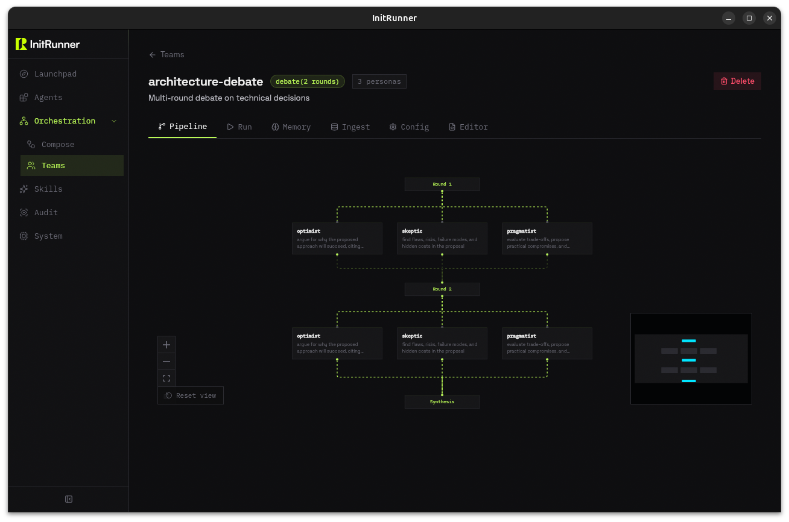

# InitRunner

<p align="center">
  <picture>
    <source media="(prefers-color-scheme: dark)" srcset="assets/logo-dark.svg">
    <source media="(prefers-color-scheme: light)" srcset="assets/logo-light.svg">
    
  </picture>
</p>

<p align="center">
  <a href="https://pypi.org/project/initrunner/"></a>
  <a href="https://pypi.org/project/initrunner/"></a>
  <a href="https://hub.docker.com/r/vladkesler/initrunner"></a>
  <a href="LICENSE-MIT"></a>
  <a href="https://ai.pydantic.dev/"></a>
  <a href="https://discord.gg/GRTZmVcW"></a>
</p>

<p align="center">
  <a href="https://initrunner.ai/">官网</a> · <a href="https://initrunner.ai/docs">文档</a> · <a href="https://hub.initrunner.ai/">InitHub</a> · <a href="https://discord.gg/GRTZmVcW">Discord</a>
</p>

<p align="center">
  <a href="README.md">English</a> · 简体中文 · <a href="README.ja.md">日本語</a>
</p>

> **注意:** 这是社区翻译版本。以 [英文 README](README.md) 为准。翻译内容可能滞后于最新更新。

YAML 优先的 AI Agent 平台。一个文件定义 Agent。同一个文件可作为交互式聊天、一次性命令、自主 Worker 或生产守护进程运行。内置 12 层安全防护。使用 `curl` 或 `pip` 安装。

<p align="center">
  <br>
  <em>architecture-debate: 乐观者、怀疑者和务实者经过 2 轮讨论后综合</em>
</p>

```bash
initrunner run helpdesk -i                                    # 文档问答，支持 RAG + 记忆
initrunner run deep-researcher -p "Compare vector databases"  # 3-Agent 研究团队
initrunner run code-review-team -p "Review the latest commit" # 多视角代码审查
```

15 个精选入门模板，60+ 示例，或自定义你自己的。

> **v2026.4.3**: 自主执行文档、Launchpad 显示 Compose/Team 运行、维度反思、预算感知续写提示、finalize_plan() 工具、Electric Charcoal 仪表盘。查看 [更新日志](CHANGELOG.md)。

## 快速开始

```bash
curl -fsSL https://initrunner.ai/install.sh | sh
initrunner setup        # 向导：选择提供商、模型、API 密钥
```

或: `uv pip install "initrunner[recommended]"` / `pipx install "initrunner[recommended]"`。查看 [安装指南](docs/getting-started/installation.md)。

### 试用入门模板

运行 `initrunner run --list` 查看完整目录。模型根据你的 API 密钥自动检测。

| 入门模板 | 功能描述 | 类型 |
|---------|---------|------|
| `helpdesk` | 导入你的文档，获得带引用和记忆的问答 Agent | Agent (RAG) |
| `code-review-team` | 多视角审查：架构师、安全专家、维护者 | Team |
| `deep-researcher` | 3-Agent 流水线：规划者、网络研究员、综合者，共享记忆 | Team |
| `codebase-analyst` | 索引你的仓库，聊架构，跨会话学习模式 | Agent (RAG) |
| `web-researcher` | 搜索网络，生成带引用的结构化简报 | Agent |
| `content-pipeline` | 话题研究、撰写、编辑/事实核查，通过 webhook 或 cron 触发 | Compose |
| `telegram-assistant` | 带记忆和网络搜索的 Telegram 机器人 | Agent (Daemon) |
| `email-agent` | 监控收件箱，分类消息，起草回复，紧急邮件通知 Slack | Agent (Daemon) |
| `support-desk` | 智能路由：自动分发到研究员、回复者或升级处理 | Compose |
| `memory-assistant` | 跨会话记忆的个人助手 | Agent |

RAG 入门模板首次运行时自动摄入。只需 `cd` 到你的项目目录：

```bash
cd ~/myproject
initrunner run codebase-analyst -i   # 索引你的代码，然后开始问答
```

### 创建自己的 Agent

```bash
initrunner new "a research assistant that summarizes papers"  # 生成 role.yaml
initrunner run --ingest ./docs/    # 或跳过 YAML，直接和你的文档聊天
```

在 [InitHub](https://hub.initrunner.ai/) 浏览和安装社区 Agent: `initrunner search "code review"` / `initrunner install alice/code-reviewer`。

**Docker**，无需安装：

```bash
docker run -d -e OPENAI_API_KEY -p 8100:8100 \
    -v initrunner-data:/data ghcr.io/vladkesler/initrunner:latest        # 仪表盘
docker run --rm -it -e OPENAI_API_KEY \
    -v initrunner-data:/data ghcr.io/vladkesler/initrunner:latest run -i # 聊天
```

更多内容查看 [Docker 指南](docs/getting-started/docker.md)。

## 用 YAML 定义 Agent

```yaml
apiVersion: initrunner/v1
kind: Agent
metadata:
  name: code-reviewer
  description: Reviews code for bugs and style issues
spec:
  role: |
    You are a senior engineer. Review code for correctness and readability.
    Use git tools to examine changes and read files for context.
  model: { provider: openai, name: gpt-5-mini }
  tools:
    - type: git
      repo_path: .
    - type: filesystem
      root_path: .
      read_only: true
```

```bash
initrunner run reviewer.yaml -p "Review the latest commit"
```

`model:` 部分是可选的；省略它，InitRunner 会根据你的 API 密钥自动检测。支持 Anthropic、OpenAI、Google、Groq、Mistral、Cohere、xAI、OpenRouter、Ollama 以及任何 OpenAI 兼容端点。28 个内置工具（文件系统、git、HTTP、Python、shell、SQL、搜索、邮件、Slack、MCP、音频、PDF 提取、CSV 分析、图像生成），你还可以用一个文件[添加自己的工具](docs/agents/tool_creation.md)。

## 从聊天到自动驾驶

同一个 YAML 文件适用于四种递进模式。你先用它聊天。效果好了，就让它自主运行。信任它之后，部署为守护进程。各阶段之间无需重写。

**交互式和一次性：**

```bash
initrunner run role.yaml -i              # REPL：来回对话
initrunner run role.yaml -p "Scan for security issues"  # 一个提示，一个回复
```

**自主模式：** 加上 `-a`，Agent 会持续工作。它建立任务列表，逐项完成，反思进度，全部做完后自动停止。你设定预算，防止失控。

```bash
initrunner run role.yaml -a -p "Scan this repo for security issues and file a report"
```

```yaml
spec:
  autonomy:
    compaction: { enabled: true, threshold: 30 }
  guardrails:
    max_iterations: 15
    autonomous_token_budget: 100000
    autonomous_timeout_seconds: 600
```

四种推理策略控制 Agent 如何处理多步骤工作：`react`（默认）、`todo_driven`、`plan_execute` 和 `reflexion`。预算约束、迭代限制、超时和空转检测（连续多轮没有工具调用）确保自主运行有界。查看 [自主执行](docs/orchestration/autonomy.md) · [护栏](docs/configuration/guardrails.md)。

**守护进程：** 添加触发器并切换到 `--daemon`。Agent 持续运行，响应 cron 调度、文件变更、webhook、Telegram 消息或 Discord 提及。每个事件触发一次提示-响应循环。

```yaml
spec:
  triggers:
    - type: cron
      schedule: "0 9 * * 1"
      prompt: "Generate the weekly status report."
    - type: file_watch
      paths: [./src]
      prompt_template: "File changed: {path}. Review it."
    - type: telegram
      allowed_user_ids: [123456789]
```

```bash
initrunner run role.yaml --daemon   # 运行直到 Ctrl+C
```

六种触发器类型：cron、webhook、file_watch、heartbeat、telegram 和 discord。守护进程热重载角色变更无需重启，执行每日和终身 Token 预算，最多同时运行 4 个触发器。查看 [触发器](docs/core/triggers.md) · [Telegram](docs/getting-started/telegram.md) · [Discord](docs/getting-started/discord.md)。

**自动驾驶：** 守护进程是响应式的。自动驾驶是*先思考，再*响应。有人给你的 Telegram 机器人发消息"帮我找从纽约到伦敦下周的航班"。在守护进程模式下，你只有一次回答机会。在自动驾驶模式下，Agent 搜索网络、比较选项、核对日期，然后发回有价值的答案。

```bash
initrunner run role.yaml --autopilot   # 每个触发器都走完整的自主循环
```

`--autopilot` 就是 `--daemon`，但每个触发器运行多步自主执行而非单次回复。护栏与 `-a` 相同：迭代限制、Token 预算、空转检测、`finish_task`。Agent 规划、使用工具、反思，完成后回复。

你也可以有选择性地设置。在单个触发器上设置 `autonomous: true`，其余保持快速单次响应。

```yaml
spec:
  triggers:
    - type: telegram
      autonomous: true          # 思考、研究，然后回复
    - type: cron
      schedule: "0 9 * * 1"
      prompt: "Generate the weekly status report."
      autonomous: true          # 规划、收集数据、撰写、审查
    - type: file_watch
      paths: [./src]
      prompt_template: "File changed: {path}. Review it."
      # autonomous: false (default) -- 快速单次响应
```

Agent 可以在运行中自行安排后续任务。查看 [自主执行](docs/orchestration/autonomy.md) · [护栏](docs/configuration/guardrails.md)。

**记忆贯穿一切。** 情景记忆、语义记忆和程序记忆在交互式会话、自主运行和守护进程触发之间持久化。每次会话结束后，整合过程使用 LLM 从事件历史中提取持久事实。Agent 不只是运行，它在学习。查看 [记忆](docs/core/memory.md)。

## 安全

InitRunner 内置 12 层安全防护。通过 `security:` 配置项启用，不是自动生效，但已集成就绪。没有 `security:` 部分的角色会获得安全默认值。重点是这些能力存在于框架内，而不是在生产六个月后从第三方库补上。

**输入：** 服务器中间件（Bearer 认证配合时序安全比对、速率限制、请求体大小限制、HTTPS 强制、安全头、CORS）。内容策略引擎（脏话过滤、禁止模式匹配、提示长度限制、可选的 LLM 话题分类器）。输入守卫能力（PydanticAI `before_run` 钩子，在 Agent 启动前验证提示）。

**授权：** [InitGuard](https://github.com/initrunner/initguard) ABAC 策略引擎（Agent 从角色元数据获取身份，每次工具调用和委托都根据类 Cedar 策略检查）。参数级权限规则（每个工具的 allow/deny glob 模式，deny 优先）。SQL 授权回调（在引擎层面阻止危险操作）。

**执行：** PEP 578 审计钩子沙箱（按线程执行文件系统写限制、子进程阻止、私有 IP 网络阻止、危险模块导入阻止、eval/exec 阻止）。Docker 容器沙箱（只读根文件系统、内存/CPU 限制、网络隔离、PID 限制）。环境变量清理（前缀和后缀匹配从每个子进程环境中剥离敏感键）。

**预算：** API 请求的令牌桶速率限制。五个粒度的 Token 预算：每次运行、每次会话、每次自主运行、守护进程每日和守护进程终身。

**审计：** 仅追加 SQLite 日志，自动敏感信息清理（16 个正则模式覆盖 GitHub Token、AWS 密钥、Stripe 密钥、Slack Token 等）。每次工具调用、委托事件和安全违规都会被记录。

```bash
export INITRUNNER_POLICY_DIR=./policies
initrunner run role.yaml                  # 工具调用 + 委托根据策略检查
```

查看 [Agent 策略](docs/security/agent-policy.md) · [安全](docs/security/security.md) · [护栏](docs/configuration/guardrails.md)。

## 为什么选择 InitRunner

**一个 YAML 文件就是 Agent。** 一个文件。可读、可 diff、可在 PR 中审查。打开它就知道 Agent 做什么：哪个模型、哪些工具、什么知识源、什么护栏。不需要先学会 Python 类层级才能配置一个工具。新团队成员读 YAML 就能理解。你在 PR 中审查 Agent 变更，就像审查其他配置一样。

**同一个文件，不同的标志。** 你用 `-i` 交互式原型的 Agent 和你用 `--daemon` 部署的 Agent 是同一个。不需要重写、不需要部署适配器、没有和开发模式不同的"生产模式"。你在运行时用标志选择执行模式，而不是在设计时用架构决策选择。

**安全内置，不是后补。** 大多数 Agent 框架把安全当作"到了生产再加认证中间件"。InitRunner 出厂就集成了策略引擎、PII 脱敏、沙箱、工具授权和审计日志。你通过配置启用它们，不需要花一个周末去接管道。

**有刹车的自主性。** Agent 无人监督运行，但不会失控。Token 预算、迭代限制、墙钟超时和空转检测都是声明式 YAML 配置。你在启动单次自主运行之前决定给它多大的自由度。

## 知识库与记忆

将你的 Agent 指向一个目录。它会自动提取、分块、嵌入并索引你的文档。对话过程中，Agent 自动搜索索引并引用找到的内容。记忆跨会话持久化。

```yaml
spec:
  ingest:
    auto: true
    sources: ["./docs/**/*.md", "./docs/**/*.pdf"]
  memory:
    semantic:
      max_memories: 1000
```

```bash
initrunner run role.yaml -i   # 首次运行自动摄入，记忆 + 搜索就绪
```

查看 [摄入](docs/core/ingestion.md) · [记忆](docs/core/memory.md) · [RAG 快速开始](docs/getting-started/rag-quickstart.md)。

## 多 Agent 编排

将 Agent 串联起来。一个 Agent 的输出传入下一个。智能路由根据每条消息自动选择正确的目标（先关键词匹配，平局时用单次 LLM 调用打破）：

```yaml
apiVersion: initrunner/v1
kind: Compose
metadata: { name: email-chain }
spec:
  services:
    inbox-watcher:
      role: roles/inbox-watcher.yaml
      sink: { type: delegate, target: triager }
    triager:
      role: roles/triager.yaml
      sink: { type: delegate, strategy: sense, target: [researcher, responder] }
    researcher: { role: roles/researcher.yaml }
    responder: { role: roles/responder.yaml }
```

运行 `initrunner compose up compose.yaml`。查看 [模式指南](docs/orchestration/patterns-guide.md) · [Compose](docs/orchestration/agent_composer.md)。

## 用户界面

<p align="center">
  <br>
  <em>仪表盘：Agent、活动、编排和团队一览</em>
</p>

```bash
pip install "initrunner[dashboard]"
initrunner dashboard                  # 打开 http://localhost:8100
```

运行 Agent、可视化构建编排、深入查看审计日志。也可作为原生桌面窗口使用（`initrunner desktop`）。查看 [仪表盘文档](docs/interfaces/dashboard.md)。

## 更多功能

| 功能 | 命令 / 配置 | 文档 |
|-----|-----------|------|
| **技能**（可复用的工具 + 提示词包） | `spec: { skills: [../skills/web-researcher] }` | [Skills](docs/agents/skills_feature.md) |
| **团队模式**（多角色处理同一任务） | `kind: Team` + `spec: { personas: {…} }` | [Team Mode](docs/orchestration/team_mode.md) |
| **API 服务器**（OpenAI 兼容端点） | `initrunner run agent.yaml --serve --port 3000` | [Server](docs/interfaces/server.md) |
| **多模态**（图像、音频、视频、文档） | `initrunner run role.yaml -p "Describe" -A photo.png` | [Multimodal](docs/core/multimodal.md) |
| **结构化输出**（验证的 JSON Schema） | `spec: { output: { schema: {…} } }` | [Structured Output](docs/core/structured-output.md) |
| **评估**（测试 Agent 输出质量） | `initrunner test role.yaml -s eval.yaml` | [Evals](docs/core/evals.md) |
| **MCP 网关**（将 Agent 暴露为 MCP 工具） | `initrunner mcp serve agent.yaml` | [MCP Gateway](docs/interfaces/mcp-gateway.md) |
| **MCP 工具箱**（无 Agent 的工具） | `initrunner mcp toolkit` | [MCP Gateway](docs/interfaces/mcp-gateway.md) |
| **能力**（原生 PydanticAI 功能） | `spec: { capabilities: [Thinking, WebSearch] }` | [Capabilities](docs/core/capabilities.md) |
| **可观测性**（OpenTelemetry 集成） | `spec: { observability: { enabled: true } }` | [Observability](docs/core/observability.md) |
| **配置**（切换任意角色的提供商/模型） | `initrunner configure role.yaml --provider groq` | [Providers](docs/configuration/providers.md) |
| **推理**（结构化思维模式） | `spec: { reasoning: { pattern: plan_execute } }` | [Reasoning](docs/core/reasoning.md) |
| **工具搜索**（按需工具发现） | `spec: { tool_search: { enabled: true } }` | [Tool Search](docs/core/tool-search.md) |

## 架构

```
initrunner/
  agent/        角色 Schema、加载器、执行器、28 个自注册工具
  authz.py      InitGuard ABAC 策略引擎集成
  runner/       一次性、REPL、自主、守护进程执行模式
  compose/      通过 compose.yaml 的多 Agent 编排
  triggers/     Cron、文件监听、webhook、心跳、Telegram、Discord
  stores/       文档 + 记忆存储（LanceDB、zvec）
  ingestion/    提取 -> 分块 -> 嵌入 -> 存储 流水线
  mcp/          MCP 服务器集成与网关
  audit/        仅追加 SQLite 审计日志，带敏感信息清理
  middleware.py 服务器安全中间件（认证、速率限制、CORS、安全头）
  services/     共享业务逻辑层
  cli/          Typer + Rich CLI 入口
```

基于 [PydanticAI](https://ai.pydantic.dev/) 构建 Agent 框架，Pydantic 用于配置验证，LanceDB 用于向量搜索。查看 [CONTRIBUTING.md](CONTRIBUTING.md) 了解开发配置。

## 分发

**InitHub:** 在 [hub.initrunner.ai](https://hub.initrunner.ai/) 浏览和安装社区 Agent。使用 `initrunner publish` 发布你自己的。查看 [Registry](docs/agents/registry.md)。

**OCI 注册表:** 将角色包推送到任何 OCI 兼容注册表: `initrunner publish oci://ghcr.io/org/my-agent --tag 1.0.0`。查看 [OCI 分发](docs/core/oci-distribution.md)。

**云部署:**

[](https://railway.com/template/FROM_REPO?referralCode=...)
[](https://render.com/deploy?repo=https://github.com/vladkesler/initrunner)

## 文档

| 领域 | 关键文档 |
|------|---------|
| 入门 | [Installation](docs/getting-started/installation.md) · [Setup](docs/getting-started/setup.md) · [Tutorial](docs/getting-started/tutorial.md) · [CLI Reference](docs/getting-started/cli.md) |
| 快速开始 | [RAG](docs/getting-started/rag-quickstart.md) · [Docker](docs/getting-started/docker.md) · [Discord Bot](docs/getting-started/discord.md) · [Telegram Bot](docs/getting-started/telegram.md) |
| Agent 与工具 | [Tools](docs/agents/tools.md) · [Tool Creation](docs/agents/tool_creation.md) · [Tool Search](docs/core/tool-search.md) · [Skills](docs/agents/skills_feature.md) · [Providers](docs/configuration/providers.md) |
| 智能 | [Reasoning](docs/core/reasoning.md) · [Intent Sensing](docs/core/intent_sensing.md) · [Autonomy](docs/orchestration/autonomy.md) · [Structured Output](docs/core/structured-output.md) |
| 知识与记忆 | [Ingestion](docs/core/ingestion.md) · [Memory](docs/core/memory.md) · [Multimodal Input](docs/core/multimodal.md) |
| 编排 | [Patterns Guide](docs/orchestration/patterns-guide.md) · [Compose](docs/orchestration/agent_composer.md) · [Delegation](docs/orchestration/delegation.md) · [Team Mode](docs/orchestration/team_mode.md) · [Triggers](docs/core/triggers.md) |
| 界面 | [Dashboard](docs/interfaces/dashboard.md) · [API Server](docs/interfaces/server.md) · [MCP Gateway](docs/interfaces/mcp-gateway.md) |
| 分发 | [OCI Distribution](docs/core/oci-distribution.md) · [Shareable Templates](docs/getting-started/shareable-templates.md) |
| 安全 | [Security Model](docs/security/security.md) · [Agent Policy](docs/security/agent-policy.md) · [Guardrails](docs/configuration/guardrails.md) |
| 运维 | [Audit](docs/core/audit.md) · [Reports](docs/core/reports.md) · [Evals](docs/core/evals.md) · [Doctor](docs/operations/doctor.md) · [Observability](docs/core/observability.md) · [CI/CD](docs/operations/cicd.md) |

## 示例

```bash
initrunner examples list               # 60+ Agent、团队和 Compose 项目
initrunner examples copy code-reviewer # 复制到当前目录
```

## 升级

运行 `initrunner doctor --role role.yaml` 检查任何角色文件的废弃字段、Schema 错误和规范版本问题。添加 `--fix` 自动修复，或 `--fix --yes` 用于 CI。查看 [废弃说明](docs/operations/deprecations.md)。

## 社区与贡献

- [Discord](https://discord.gg/GRTZmVcW): 聊天、提问、分享角色
- [GitHub Issues](https://github.com/vladkesler/initrunner/issues): Bug 报告和功能请求
- [Changelog](CHANGELOG.md): 发布说明

欢迎贡献！查看 [CONTRIBUTING.md](CONTRIBUTING.md) 了解开发配置和 PR 指南。

## 许可证

根据 [MIT](LICENSE-MIT) 或 [Apache-2.0](LICENSE-APACHE) 许可，由你选择。

---

<p align="center"><sub>v2026.4.3</sub></p>
