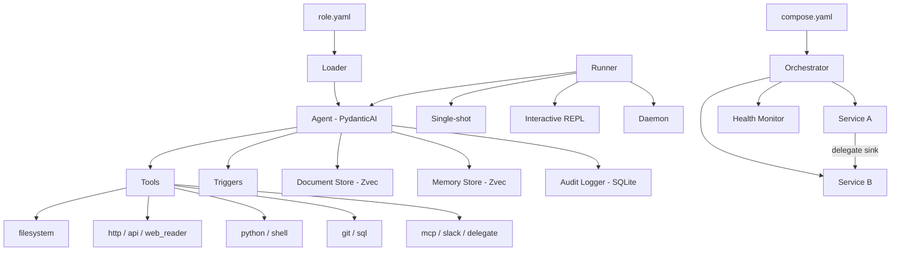

# Providers & Model Configuration

The default model is `openai`/`gpt-5-mini`. You can switch to any supported provider, a local Ollama instance, or a custom OpenAI-compatible endpoint by changing the `spec.model` block in your role YAML.

## Standard providers

Change `provider` and `name`, then install the matching extra if needed:

```yaml
spec:
  model:
    provider: anthropic
    name: claude-sonnet-4-20250514
```

| Provider | Env Var | Extra to install | Example model |
|----------|---------|-----------------|---------------|
| `openai` | `OPENAI_API_KEY` | *(included)* | `gpt-5-mini` |
| `anthropic` | `ANTHROPIC_API_KEY` | `initrunner[anthropic]` | `claude-sonnet-4-20250514` |
| `google` | `GOOGLE_API_KEY` | `initrunner[google]` | `gemini-2.0-flash` |
| `groq` | `GROQ_API_KEY` | `initrunner[groq]` | `llama-3.3-70b-versatile` |
| `mistral` | `MISTRAL_API_KEY` | `initrunner[mistral]` | `mistral-large-latest` |
| `cohere` | `CO_API_KEY` | `initrunner[all-models]` | `command-r-plus` |
| `bedrock` | `AWS_ACCESS_KEY_ID` | `initrunner[all-models]` | `us.anthropic.claude-sonnet-4-20250514-v1:0` |
| `xai` | `XAI_API_KEY` | `initrunner[all-models]` | `grok-3` |

Install all provider extras at once with `pip install initrunner[all-models]`.

### Provider snippets

**OpenAI** (no extra required):
```yaml
spec:
  model:
    provider: openai
    name: gpt-5-mini
```

**Anthropic** (`pip install initrunner[anthropic]`):
```yaml
spec:
  model:
    provider: anthropic
    name: claude-sonnet-4-5-20250929
```

**Google** (`pip install initrunner[google]`):
```yaml
spec:
  model:
    provider: google
    name: gemini-2.0-flash
```

**Groq** (`pip install initrunner[groq]`):
```yaml
spec:
  model:
    provider: groq
    name: llama-3.3-70b-versatile
```

**Mistral** (`pip install initrunner[mistral]`):
```yaml
spec:
  model:
    provider: mistral
    name: mistral-large-latest
```

**Cohere** (`pip install initrunner[all-models]`):
```yaml
spec:
  model:
    provider: cohere
    name: command-r-plus
```

**Bedrock** (`pip install initrunner[all-models]`):
```yaml
spec:
  model:
    provider: bedrock
    name: us.anthropic.claude-sonnet-4-20250514-v1:0
```

**xAI** (`pip install initrunner[all-models]`):
```yaml
spec:
  model:
    provider: xai
    name: grok-3
```

## Model Selection

`PROVIDER_MODELS` in `templates.py` maintains curated model lists for each provider. The interactive wizard (`initrunner init -i`) and setup command (`initrunner setup`) present these as a numbered menu. The `--model` flag on `init`, `setup`, and `create` bypasses the interactive prompt. Custom model names are always accepted — the curated list is a convenience, not a restriction.

| Provider | Model | Description |
|----------|-------|-------------|
| `openai` | **`gpt-5-mini`** | Fast, affordable (default) |
| `openai` | `gpt-4o` | High capability GPT-4 |
| `openai` | `gpt-4.1` | Latest GPT-4.1 |
| `openai` | `gpt-4.1-mini` | Small GPT-4.1 |
| `openai` | `gpt-4.1-nano` | Fastest GPT-4.1 |
| `openai` | `o3-mini` | Reasoning model |
| `anthropic` | **`claude-sonnet-4-5-20250929`** | Balanced, fast (default) |
| `anthropic` | `claude-haiku-35-20241022` | Compact, very fast |
| `anthropic` | `claude-opus-4-20250514` | Most capable |
| `google` | **`gemini-2.0-flash`** | Fast multimodal (default) |
| `google` | `gemini-2.5-pro-preview-05-06` | Most capable |
| `google` | `gemini-2.0-flash-lite` | Lightweight |
| `groq` | **`llama-3.3-70b-versatile`** | Fast Llama 70B (default) |
| `groq` | `llama-3.1-8b-instant` | Ultra-fast 8B |
| `groq` | `mixtral-8x7b-32768` | Mixtral MoE |
| `mistral` | **`mistral-large-latest`** | Most capable (default) |
| `mistral` | `mistral-small-latest` | Fast, efficient |
| `mistral` | `codestral-latest` | Code-optimized |
| `cohere` | **`command-r-plus`** | Advanced RAG (default) |
| `cohere` | `command-r` | Balanced |
| `cohere` | `command-light` | Fast |
| `bedrock` | **`us.anthropic.claude-sonnet-4-20250514-v1:0`** | Claude Sonnet via Bedrock (default) |
| `bedrock` | `us.anthropic.claude-haiku-4-20250514-v1:0` | Claude Haiku via Bedrock |
| `bedrock` | `us.meta.llama3-2-90b-instruct-v1:0` | Llama 3.2 90B via Bedrock |
| `xai` | **`grok-3`** | Most capable Grok (default) |
| `xai` | `grok-3-mini` | Fast Grok |
| `ollama` | **`llama3.2`** | Llama 3.2 (default) |
| `ollama` | `llama3.1` | Llama 3.1 |
| `ollama` | `mistral` | Mistral 7B |
| `ollama` | `codellama` | Code Llama |
| `ollama` | `phi3` | Microsoft Phi-3 |

For Ollama, the wizard also queries the local Ollama server for installed models and shows those if available.

## Ollama (local models)

Set `provider: ollama`. No API key is needed — the runner defaults to `http://localhost:11434/v1`:

```yaml
spec:
  model:
    provider: ollama
    name: llama3.2
```

Override the URL if Ollama is on a different host or port:

```yaml
spec:
  model:
    provider: ollama
    name: llama3.2
    base_url: http://192.168.1.50:11434/v1
```

> **Docker note:** If the runner is inside Docker and Ollama is on the host, use `http://host.docker.internal:11434/v1` as the `base_url`.

See [ollama.md](ollama.md) for a full Ollama setup guide.

## OpenRouter / custom endpoints

Any OpenAI-compatible API works. Set `provider: openai`, point `base_url` at the endpoint, and tell the runner which env var holds the API key:

```yaml
spec:
  model:
    provider: openai
    name: anthropic/claude-sonnet-4
    base_url: https://openrouter.ai/api/v1
    api_key_env: OPENROUTER_API_KEY
```

This also works for vLLM, LiteLLM, Azure OpenAI, or any other service that exposes the OpenAI chat completions format.

> **Embedding endpoints:** `api_key_env` works for all embedding providers (standard and custom) via `ingest.embeddings.api_key_env` or `memory.embeddings.api_key_env`. When set, InitRunner validates the key at startup and fails fast with an actionable error if it's missing. See [Ingestion: Embedding Options](../core/ingestion.md#embedding-options) for details.

## Model config reference

| Field | Type | Default | Description |
|-------|------|---------|-------------|
| `provider` | string | `openai` | Provider name (`openai`, `anthropic`, `google`, `groq`, `mistral`, `cohere`, `bedrock`, `xai`, `ollama`) |
| `name` | string | `gpt-5-mini` | Model identifier |
| `base_url` | string | *null* | Custom endpoint URL (triggers OpenAI-compatible mode) |
| `api_key_env` | string | *null* | Environment variable containing the API key |
| `temperature` | float | `0.1` | Sampling temperature (0.0-2.0) |
| `max_tokens` | int | `4096` | Maximum tokens per response (1-128000) |

## Embedding Configuration

When using RAG (`spec.ingest`) or memory (`spec.memory`), InitRunner needs an embedding model to generate vectors. The embedding provider is resolved separately from the agent's LLM provider.

### Default Resolution

The embedding model is determined by the agent's `spec.model.provider` unless overridden:

| Agent Provider | Default Embedding Model | Requires |
|---------------|------------------------|----------|
| `openai` | `openai:text-embedding-3-small` | `OPENAI_API_KEY` |
| `anthropic` | `openai:text-embedding-3-small` | `OPENAI_API_KEY` |
| `google` | `google:text-embedding-004` | `GOOGLE_API_KEY` |
| `ollama` | `ollama:nomic-embed-text` | Ollama running locally |
| All others | `openai:text-embedding-3-small` | `OPENAI_API_KEY` |

> **Important:** Anthropic does not offer an embeddings API. If your agent uses `provider: anthropic`, you still need `OPENAI_API_KEY` set for embeddings. This only applies when using RAG or memory — pure chat agents don't need it.

### Overriding the Embedding Model

Set `embeddings.provider` and `embeddings.model` in your `ingest` or `memory` config:

```yaml
spec:
  model:
    provider: anthropic
    name: claude-sonnet-4-5-20250929
  ingest:
    sources: ["./docs/**/*.md"]
    embeddings:
      provider: openai
      model: text-embedding-3-large
```

### Custom Embedding Endpoints

For self-hosted or third-party embedding services, use `base_url` and `api_key_env`:

```yaml
spec:
  ingest:
    embeddings:
      provider: openai
      model: my-embedding-model
      base_url: https://my-embedding-service.example.com/v1
      api_key_env: MY_EMBEDDING_API_KEY
```

### Embedding Config Reference

| Field | Type | Default | Description |
|-------|------|---------|-------------|
| `provider` | `str` | `""` | Embedding provider. Empty string derives from `spec.model.provider`. |
| `model` | `str` | `""` | Embedding model name. Empty string uses the provider default. |
| `base_url` | `str` | `""` | Custom endpoint URL. Triggers OpenAI-compatible mode. |
| `api_key_env` | `str` | `""` | Env var holding the embedding API key. Works for all providers (not just custom endpoints). When empty, the default key for the resolved provider is used automatically. |

See [Ingestion: Embedding Models](../core/ingestion.md#embedding-models) for the full embedding model reference and [RAG Guide: Embedding Model Options](../core/rag-guide.md#embedding-model-options) for a comparison table.

## Full role example

A complete role definition showing model, tools, ingestion, triggers, and guardrails:

```yaml
apiVersion: initrunner/v1
kind: Agent
metadata:
  name: support-agent
  description: Answers questions from the support knowledge base
  tags:
    - support
    - rag
spec:
  role: |
    You are a support agent. Use search_documents to find relevant
    articles before answering. Always cite your sources.
  model:
    provider: openai
    name: gpt-5-mini
    temperature: 0.1
    max_tokens: 4096
  ingest:
    sources:
      - "./knowledge-base/**/*.md"
      - "./docs/**/*.pdf"
    chunking:
      strategy: fixed
      chunk_size: 512
      chunk_overlap: 50
  tools:
    - type: filesystem
      root_path: ./src
      read_only: true
    - type: mcp
      transport: stdio
      command: npx
      args: ["-y", "@anthropic/mcp-server-filesystem"]
  triggers:
    - type: file_watch
      paths: ["./knowledge-base"]
      extensions: [".html", ".md"]
      prompt_template: "Knowledge base updated: {path}. Re-index."
    - type: cron
      schedule: "0 9 * * 1"
      prompt: "Generate weekly support coverage report."
  guardrails:
    max_tokens_per_run: 50000
    max_tool_calls: 20
    timeout_seconds: 300
    max_request_limit: 50
```

## Architecture



YAML role files define the agent. The loader parses and validates them, then constructs a PydanticAI agent wired with the configured tools, stores, and audit logger. The runner executes the agent in one of three modes: single-shot, interactive REPL, or trigger-driven daemon. For multi-agent workflows, a compose definition orchestrates multiple services with inter-service delegation and health monitoring.
