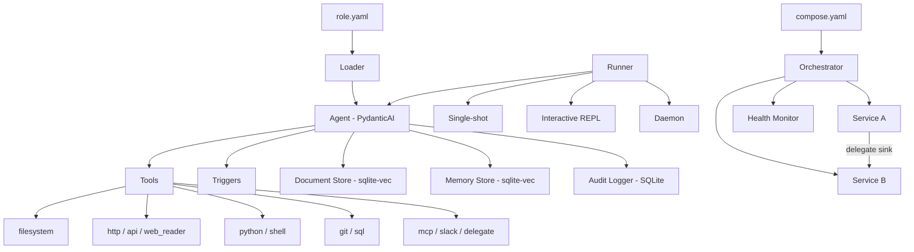

# Providers & Model Configuration

The default model is `openai`/`gpt-4o-mini`. You can switch to any supported provider, a local Ollama instance, or a custom OpenAI-compatible endpoint by changing the `spec.model` block in your role YAML.

## Standard providers

Change `provider` and `name`, then install the matching extra if needed:

```yaml
spec:
  model:
    provider: anthropic
    name: claude-sonnet-4-20250514
```

| Provider | Extra to install | Example model |
|----------|-----------------|---------------|
| `openai` | *(included)* | `gpt-4o-mini` |
| `anthropic` | `initrunner[anthropic]` | `claude-sonnet-4-20250514` |
| `google` | `initrunner[google]` | `gemini-2.0-flash` |
| `groq` | `initrunner[groq]` | `llama-3.3-70b-versatile` |
| `mistral` | `initrunner[mistral]` | `mistral-large-latest` |
| `cohere` | `initrunner[all-models]` | `command-r-plus` |
| `bedrock` | `initrunner[all-models]` | `us.anthropic.claude-sonnet-4-20250514-v1:0` |
| `xai` | `initrunner[all-models]` | `grok-3` |

Install all provider extras at once with `pip install initrunner[all-models]`.

## Ollama (local models)

Set `provider: ollama`. No API key is needed — the runner defaults to `http://localhost:11434/v1`:

```yaml
spec:
  model:
    provider: ollama
    name: llama3.2
```

Override the URL if Ollama is on a different host or port:

```yaml
spec:
  model:
    provider: ollama
    name: llama3.2
    base_url: http://192.168.1.50:11434/v1
```

> **Docker note:** If the runner is inside Docker and Ollama is on the host, use `http://host.docker.internal:11434/v1` as the `base_url`.

See [ollama.md](ollama.md) for a full Ollama setup guide.

## OpenRouter / custom endpoints

Any OpenAI-compatible API works. Set `provider: openai`, point `base_url` at the endpoint, and tell the runner which env var holds the API key:

```yaml
spec:
  model:
    provider: openai
    name: anthropic/claude-sonnet-4
    base_url: https://openrouter.ai/api/v1
    api_key_env: OPENROUTER_API_KEY
```

This also works for vLLM, LiteLLM, Azure OpenAI, or any other service that exposes the OpenAI chat completions format.

> **Embedding endpoints:** `api_key_env` also works for custom embedding endpoints via `ingest.embeddings.api_key_env` or `memory.embeddings.api_key_env`. See [Ingestion: Embedding Options](../core/ingestion.md#embedding-options) for details.

## Model config reference

| Field | Type | Default | Description |
|-------|------|---------|-------------|
| `provider` | string | `openai` | Provider name (`openai`, `anthropic`, `google`, `groq`, `mistral`, `cohere`, `bedrock`, `xai`, `ollama`) |
| `name` | string | `gpt-4o-mini` | Model identifier |
| `base_url` | string | *null* | Custom endpoint URL (triggers OpenAI-compatible mode) |
| `api_key_env` | string | *null* | Environment variable containing the API key |
| `temperature` | float | `0.1` | Sampling temperature (0.0-2.0) |
| `max_tokens` | int | `4096` | Maximum tokens per response (1-128000) |

## Full role example

A complete role definition showing model, tools, ingestion, triggers, and guardrails:

```yaml
apiVersion: initrunner/v1
kind: Agent
metadata:
  name: support-agent
  description: Answers questions from the support knowledge base
  tags:
    - support
    - rag
spec:
  role: |
    You are a support agent. Use search_documents to find relevant
    articles before answering. Always cite your sources.
  model:
    provider: openai
    name: gpt-4o-mini
    temperature: 0.1
    max_tokens: 4096
  ingest:
    sources:
      - "./knowledge-base/**/*.md"
      - "./docs/**/*.pdf"
    chunking:
      strategy: fixed
      chunk_size: 512
      chunk_overlap: 50
  tools:
    - type: filesystem
      root_path: ./src
      read_only: true
    - type: mcp
      transport: stdio
      command: npx
      args: ["-y", "@anthropic/mcp-server-filesystem"]
  triggers:
    - type: file_watch
      paths: ["./knowledge-base"]
      extensions: [".html", ".md"]
      prompt_template: "Knowledge base updated: {path}. Re-index."
    - type: cron
      schedule: "0 9 * * 1"
      prompt: "Generate weekly support coverage report."
  guardrails:
    max_tokens_per_run: 50000
    max_tool_calls: 20
    timeout_seconds: 300
    max_request_limit: 50
```

## Architecture



YAML role files define the agent. The loader parses and validates them, then constructs a PydanticAI agent wired with the configured tools, stores, and audit logger. The runner executes the agent in one of three modes: single-shot, interactive REPL, or trigger-driven daemon. For multi-agent workflows, a compose definition orchestrates multiple services with inter-service delegation and health monitoring.
