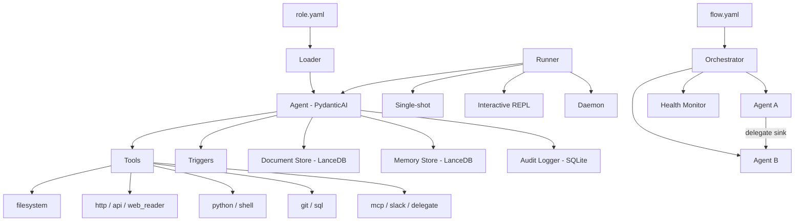

# Providers & Model Configuration

The default model is `openai`/`gpt-5-mini`. You can switch to any supported provider, a local Ollama instance, or a custom OpenAI-compatible endpoint by changing the `spec.model` block in your role YAML.

Every `api_key_env` below is resolved through env vars first, then the [Credential Vault](../security/vault.md) if one is initialized. Existing workflows keep working unchanged.

## Standard providers

Change `provider` and `name`, then install the matching extra if needed:

```yaml
spec:
  model:
    provider: anthropic
    name: claude-sonnet-4-20250514
```

| Provider | Env Var | Extra to install | Example model |
|----------|---------|-----------------|---------------|
| `openai` | `OPENAI_API_KEY` | *(included)* | `gpt-5-mini` |
| `anthropic` | `ANTHROPIC_API_KEY` | `initrunner[anthropic]` | `claude-sonnet-4-20250514` |
| `google` | `GOOGLE_API_KEY` | `initrunner[google]` | `gemini-2.0-flash` |
| `groq` | `GROQ_API_KEY` | `initrunner[groq]` | `llama-3.3-70b-versatile` |
| `mistral` | `MISTRAL_API_KEY` | `initrunner[mistral]` | `mistral-large-latest` |
| `cohere` | `CO_API_KEY` | `initrunner[all-models]` | `command-r-plus` |
| `bedrock` | `AWS_ACCESS_KEY_ID` | `initrunner[all-models]` | `us.anthropic.claude-sonnet-4-20250514-v1:0` |
| `xai` | `XAI_API_KEY` | `initrunner[all-models]` | `grok-3` |

Install all provider extras at once with `pip install initrunner[all-models]`.

> **Dashboard setup:** API keys can also be configured from the dashboard. Run `initrunner dashboard` and use the inline key form on the launchpad, or navigate to the System page for full provider management. Keys are saved to `~/.initrunner/.env`.

### Provider snippets

**OpenAI** (no extra required):
```yaml
spec:
  model:
    provider: openai
    name: gpt-5-mini
```

**Anthropic** (`pip install initrunner[anthropic]`):
```yaml
spec:
  model:
    provider: anthropic
    name: claude-sonnet-4-5-20250929
```

**Google** (`pip install initrunner[google]`):
```yaml
spec:
  model:
    provider: google
    name: gemini-2.0-flash
```

**Groq** (`pip install initrunner[groq]`):
```yaml
spec:
  model:
    provider: groq
    name: llama-3.3-70b-versatile
```

**Mistral** (`pip install initrunner[mistral]`):
```yaml
spec:
  model:
    provider: mistral
    name: mistral-large-latest
```

**Cohere** (`pip install initrunner[all-models]`):
```yaml
spec:
  model:
    provider: cohere
    name: command-r-plus
```

**Bedrock** (`pip install initrunner[all-models]`):
```yaml
spec:
  model:
    provider: bedrock
    name: us.anthropic.claude-sonnet-4-20250514-v1:0
```

**xAI** (`pip install initrunner[all-models]`):
```yaml
spec:
  model:
    provider: xai
    name: grok-3
```

## Model Selection

`PROVIDER_MODELS` in `templates.py` maintains curated model lists for each provider. The interactive wizard (`initrunner new`) and setup command (`initrunner setup`) present these as a numbered menu. The `--model` flag on `setup` bypasses the interactive prompt. Custom model names are always accepted -- the curated list is a convenience, not a restriction.

| Provider | Model | Description |
|----------|-------|-------------|
| `openai` | **`gpt-5-mini`** | Fast, affordable (default) |
| `openai` | `gpt-4o` | High capability GPT-4 |
| `openai` | `gpt-4.1` | Latest GPT-4.1 |
| `openai` | `gpt-4.1-mini` | Small GPT-4.1 |
| `openai` | `gpt-4.1-nano` | Fastest GPT-4.1 |
| `openai` | `o3-mini` | Reasoning model |
| `anthropic` | **`claude-sonnet-4-5-20250929`** | Balanced, fast (default) |
| `anthropic` | `claude-sonnet-5` | Frontier (latest generation) |
| `anthropic` | `claude-haiku-35-20241022` | Compact, very fast |
| `anthropic` | `claude-opus-4-20250514` | Most capable |
| `google` | **`gemini-2.0-flash`** | Fast multimodal (default) |
| `google` | `gemini-2.5-pro-preview-05-06` | Most capable |
| `google` | `gemini-2.0-flash-lite` | Lightweight |
| `groq` | **`llama-3.3-70b-versatile`** | Fast Llama 70B (default) |
| `groq` | `llama-3.1-8b-instant` | Ultra-fast 8B |
| `groq` | `mixtral-8x7b-32768` | Mixtral MoE |
| `mistral` | **`mistral-large-latest`** | Most capable (default) |
| `mistral` | `mistral-small-latest` | Fast, efficient |
| `mistral` | `codestral-latest` | Code-optimized |
| `cohere` | **`command-r-plus`** | Advanced RAG (default) |
| `cohere` | `command-r` | Balanced |
| `cohere` | `command-light` | Fast |
| `bedrock` | **`us.anthropic.claude-sonnet-4-20250514-v1:0`** | Claude Sonnet via Bedrock (default) |
| `bedrock` | `us.anthropic.claude-sonnet-5` | Claude Sonnet 5 (latest) |
| `bedrock` | `us.anthropic.claude-haiku-4-20250514-v1:0` | Claude Haiku via Bedrock |
| `bedrock` | `us.meta.llama3-2-90b-instruct-v1:0` | Llama 3.2 90B via Bedrock |
| `bedrock` | `zai.glm-5` | Z.AI GLM-5 via Bedrock |
| `bedrock` | `moonshotai.kimi-k2.5` | Moonshot Kimi K2.5 via Bedrock |
| `xai` | **`grok-3`** | Most capable Grok (default) |
| `xai` | `grok-4.5` | Latest Grok |
| `xai` | `grok-3-mini` | Fast Grok |
| `ollama` | **`llama3.2`** | Llama 3.2 (default) |
| `ollama` | `llama3.1` | Llama 3.1 |
| `ollama` | `mistral` | Mistral 7B |
| `ollama` | `codellama` | Code Llama |
| `ollama` | `phi3` | Microsoft Phi-3 |

For Ollama, the wizard also queries the local Ollama server for installed models and shows those if available.

Moonshot and Z.AI models are also reachable directly (without going through Bedrock) by passing a `provider:model` string such as `moonshotai:kimi-k3` or `zai:glm-5`, since any `provider:model` name PydanticAI recognizes is accepted even when it is not in the curated menu.

## Ollama (local models)

Set `provider: ollama`. No API key is needed — the runner defaults to `http://localhost:11434/v1`:

```yaml
spec:
  model:
    provider: ollama
    name: llama3.2
```

Override the URL if Ollama is on a different host or port:

```yaml
spec:
  model:
    provider: ollama
    name: llama3.2
    base_url: http://192.168.1.50:11434/v1
```

> **Docker note:** If the runner is inside Docker and Ollama is on the host, use `http://host.docker.internal:11434/v1` as the `base_url`.

See [ollama.md](ollama.md) for a full Ollama setup guide.

## OpenRouter / custom endpoints

### Quick setup via wizard

If `OPENROUTER_API_KEY` is set in your environment or `~/.initrunner/.env`, the setup wizard auto-detects it:

```bash
export OPENROUTER_API_KEY="sk-or-..."
initrunner setup
# -> Detected OpenRouter (OPENROUTER_API_KEY). Use this provider? [Y/n]
```

Confirming writes canonical runtime config to `~/.initrunner/run.yaml`:

```yaml
provider: openai
model: anthropic/claude-sonnet-4
base_url: https://openrouter.ai/api/v1
api_key_env: OPENROUTER_API_KEY
```

The ephemeral REPL (`initrunner run -i` or the no-subcommand Quick chat) automatically picks up these fields.

### Manual role configuration

Any OpenAI-compatible API works in role YAML. Set `provider: openai`, point `base_url` at the endpoint, and tell the runner which env var holds the API key:

```yaml
spec:
  model:
    provider: openai
    name: anthropic/claude-sonnet-4
    base_url: https://openrouter.ai/api/v1
    api_key_env: OPENROUTER_API_KEY
```

This also works for vLLM, LiteLLM, Azure OpenAI, or any other service that exposes the OpenAI chat completions format.

> **Embedding endpoints:** `api_key_env` works for all embedding providers (standard and custom) via `ingest.embeddings.api_key_env` or `memory.embeddings.api_key_env`. When set, InitRunner validates the key at startup and fails fast with an actionable error if it's missing. See [Ingestion: Embedding Options](../core/ingestion.md#embedding-options) for details.

## Switching providers

### `initrunner configure`

Switch the provider/model for any role without editing YAML:

```bash
# Non-interactive: specify provider (model auto-selected)
initrunner configure role.yaml --provider groq

# Non-interactive: specify both provider and model
initrunner configure my-agent --provider ollama --model deepseek-coder-v2

# Interactive: shows available providers and model picker
initrunner configure role.yaml

# Reset an installed role back to its original provider
initrunner configure my-agent --reset
```

For installed roles (from InitHub or OCI), the override is stored in the registry manifest and survives updates. For local YAML files, the file is edited directly.

### Post-install provider adaptation

When you install a role from InitHub, InitRunner checks if you have the required API key. If not, it offers to adapt the role to a provider you have configured:

```
$ initrunner install acme/support-bot

Installed acme/support-bot -> ~/.initrunner/roles/hub__acme__support-bot/

+-- Provider Check ----------------------------------------+
|  Role uses:  mistral / mistral-large-latest               |
|  MISTRAL_API_KEY: Missing                                  |
|                                                            |
|  1. Adapt to openai (gpt-5-mini)                           |
|  2. Adapt to ollama (llama3.2)                             |
|  3. Keep as-is (set MISTRAL_API_KEY later)                 |
+-----------------------------------------------------------+
Adapt? [1-3] (1):
```

The override is stored in the registry and applied at runtime. The installed YAML stays pristine, so updates from the author don't conflict with your local provider choice.

Use `--yes` for non-interactive mode (auto-adapts to your top available provider).

## Model aliases & runtime override

You can define semantic aliases (`fast`, `smart`, `local`) in `~/.initrunner/models.yaml` and override the model at runtime with `--model` or `INITRUNNER_MODEL`. See [Model Aliases](model-aliases.md) for full details.

```bash
# Override model at runtime
initrunner run role.yaml -p "hello" --model fast

# Use alias in role YAML (provider auto-resolved)
spec:
  model:
    name: fast
```

## Multi-provider fallback

Set `model.fallback` to a list of `provider:model` strings (or aliases from `~/.initrunner/models.yaml`) to get automatic provider failover. InitRunner wraps the primary and fallbacks in PydanticAI's [`FallbackModel`](https://ai.pydantic.dev/models/#fallback); on any API error from the primary (including 429 and 5xx), the next candidate is tried, in declaration order.

```yaml
spec:
  model:
    provider: anthropic
    name: claude-sonnet-4-5-20250929
    fallback:
      - openai:gpt-4o-mini
      - google:gemini-2.5-flash
```

Notes:

- The **primary** drives sampling config (`temperature`, `max_tokens`, reasoning detection). Fallbacks inherit the same `ModelSettings`, so pick models that accept those settings.
- API keys for **every** model in the chain must be available at role-load time. `FallbackModel` constructs per-provider clients eagerly; a missing key on a fallback fails fast at startup, not at failover time.
- Fallback entries are standard-provider strings only. Ollama and custom `base_url` endpoints are not supported as fallbacks in this release.
- On a **successful** fallback, PydanticAI discards the primary's exception. The run succeeds; the per-provider failure is not surfaced in the audit log. If every candidate fails, the audit record is marked failed and the error lists each inner failure (e.g. `All 3 fallback models failed: [anthropic:... HTTP 500, openai:... HTTP 429, google:... HTTP 503]`).
- Each candidate (primary and every fallback) carries its own [HTTP retry transport](#http-retries), so a transient 429/5xx is retried in place before InitRunner gives up on that candidate and moves to the next.
- By default, failover triggers on `ModelAPIError` (any provider API/HTTP failure). Narrow or widen the trigger with `fallback_on`:

  ```yaml
  spec:
    model:
      provider: anthropic
      name: claude-sonnet-4-5-20250929
      fallback: [openai:gpt-4o-mini]
      fallback_on: [ModelHTTPError, ContentFilterError]
  ```

  Valid names are PydanticAI exception types: `ModelAPIError` (the default; base for API/HTTP failures), `ModelHTTPError` (HTTP status errors only), `UnexpectedModelBehavior`, and `ContentFilterError`. `fallback_on` requires a non-empty `fallback` list.

## HTTP retries

Every model request is retried at the HTTP transport layer on transient errors (status `429`, `500`, `502`, `503`, `504`) using PydanticAI's [`AsyncTenacityTransport`](https://ai.pydantic.dev/retries/). Retries use exponential backoff and honor a `Retry-After` response header when the provider sends one. Permanent errors (`400`, `401`, `403`, `404`, `422`, ...) are **not** retried -- they surface immediately. The transport applies to OpenAI, Anthropic, Google, Groq, Mistral, Cohere, and every custom OpenAI-compatible endpoint (Ollama, vLLM, OpenRouter). Bedrock (boto3) and xAI (gRPC) rely on their own SDKs' native retry handling.

Tune it under `spec.execution`:

```yaml
spec:
  execution:
    http_retries: 3          # total attempts per request (1-10, default 3)
    http_retry_max_wait: 60  # cap in seconds for one backoff/Retry-After wait (default 60)
```

Because retries live in the httpx transport (below the agent loop), they apply uniformly to one-shot, REPL, streaming, and daemon runs without restarting the whole agent turn. Daemon trigger runs additionally have their own higher-level [retry policy and circuit breaker](guardrails.md) for retrying an entire run.

## Model request concurrency

Cap how many model requests are in flight at once, optionally sharing one budget across several agents in the same process (compose services, team personas, flow nodes). This is distinct from `execution.max_concurrency`, which bounds an agent's parallel *tool* execution; this bounds *model requests* and is the lever for staying under a provider's rate limit when many agents share an API key.

```yaml
spec:
  model:
    concurrency:
      max_running: 4          # max concurrent in-flight requests
      max_queued: 50          # optional: reject once this many are waiting
      share: openai-pool      # optional: agents with the same name share one budget
```

Without `share`, the cap is per-agent. With a `share` name, every agent (in the same process) whose model config uses that name coordinates against a single `ConcurrencyLimiter` -- so a pool of five personas hitting one OpenAI key can be held to, say, four concurrent requests total. The first config registered for a given name sets its limits. Maps to PydanticAI's `ConcurrencyLimitedModel`.

## Model config reference

| Field | Type | Default | Description |
|-------|------|---------|-------------|
| `provider` | string | *(empty)* | Provider name. Required unless `name` contains a colon or resolves via alias. Values: `openai`, `anthropic`, `google`, `groq`, `mistral`, `cohere`, `bedrock`, `xai`, `ollama` |
| `name` | string | *(required)* | Model identifier, alias name, or `provider:model` string |
| `base_url` | string | *null* | Custom endpoint URL (triggers OpenAI-compatible mode) |
| `api_key_env` | string | *null* | Environment variable containing the API key |
| `temperature` | float | `0.1` | Sampling temperature (0.0-2.0) |
| `max_tokens` | int | `4096` | Maximum tokens per response (1-128000) |
| `context_window` | int \| null | *null* | Model context window in tokens. Used by the [context budget guard](../orchestration/autonomy.md#context-budget-guard) to prevent history overflow. Auto-detected from provider when null. |
| `concurrency` | mapping \| null | *null* | Cap concurrent model requests (`max_running`, `max_queued`, `share`). See [Model request concurrency](#model-request-concurrency). |
| `fallback` | list[str] | `[]` | Ordered list of `provider:model` strings (or aliases). When non-empty, the primary and fallbacks are wrapped in a `FallbackModel` for automatic failover on API errors. Standard providers only. |
| `fallback_on` | list[str] | `[]` | Exception types that trigger failover (`ModelAPIError`, `ModelHTTPError`, `UnexpectedModelBehavior`, `ContentFilterError`). Empty uses the `ModelAPIError` default. Requires `fallback`. |
| `top_p` | float \| null | *null* | Nucleus sampling threshold (0.0-1.0). Dropped on OpenAI reasoning models, like `temperature`. |
| `top_k` | int \| null | *null* | Top-k sampling cutoff. Dropped on OpenAI reasoning models. |
| `seed` | int \| null | *null* | Best-effort deterministic sampling on providers that support it |
| `stop_sequences` | list[str] \| null | *null* | Sequences that end generation when produced |
| `parallel_tool_calls` | bool \| null | *null* | Whether the model may request multiple tool calls in one turn |
| `presence_penalty` | float \| null | *null* | Penalize tokens already present (-2.0-2.0). Dropped on OpenAI reasoning models. |
| `frequency_penalty` | float \| null | *null* | Penalize tokens by frequency (-2.0-2.0). Dropped on OpenAI reasoning models. |
| `logit_bias` | dict[str, int] \| null | *null* | Per-token likelihood adjustments. Dropped on OpenAI reasoning models. |
| `extra_headers` | dict[str, str] \| null | *null* | Extra HTTP headers sent with every model request |
| `extra_body` | dict \| null | *null* | Extra JSON merged into the provider request body (provider-specific routing flags etc.) |
| `tool_choice` | `auto` \| `none` \| null | *null* | Static tool policy. `none` disables tool calls (text-only mode). `required` and tool-name lists are rejected: they would force a tool call on every step; per-step forcing needs a dynamic capability. |
| `thinking` | bool \| string \| null | *null* | Native extended-thinking effort (`minimal`/`low`/`medium`/`high`/`xhigh`, `false` disables). Reasoning-capable OpenAI models only. |
| `prompt_cache` | bool \| mapping \| null | *null* | Provider-native prompt caching (Anthropic, Bedrock only). See [Prompt caching](#prompt-caching). |

## Prompt caching

Anthropic and Bedrock can cache the static prefix of a request (system instructions + tool definitions) so repeated runs of a role reuse it instead of re-billing those input tokens. This is worthwhile for daemons, triggers, and REPLs whose system prompt (role text, skill prompts, large tool surfaces) dwarfs the per-turn user input.

Enable it with the shorthand:

```yaml
spec:
  model:
    provider: anthropic
    name: claude-sonnet-4-5-20250929
    prompt_cache: true        # caches instructions + tool definitions, 5m TTL
```

Or tune it:

```yaml
spec:
  model:
    prompt_cache:
      instructions: true       # cache the system prompt (default true)
      tools: true              # cache the tool definitions block (default true)
      ttl: 1h                  # "5m" (default) or "1h"
```

This maps to PydanticAI's `anthropic_cache_instructions` / `anthropic_cache_tool_definitions` (and the `bedrock_cache_*` equivalents). It is rejected at load time on any other provider, since only Anthropic and Bedrock honor these settings. The first request writes the cache (a small surcharge); subsequent requests within the TTL read it at a large discount. Cache reads/writes show up in the provider's usage as `cache_read`/`cache_write` tokens.

To confirm caching is actually paying off, watch the run summary line: when the provider reports a cache hit, InitRunner appends `cache hit: NN%` to the `tokens: …` stats (from PydanticAI's `cache_hit_ratio`, the fraction of input tokens served from cache). The suffix is omitted entirely when the ratio is zero or unreported, so it stays quiet for `TestModel` and non-caching providers.

## Embedding Configuration

When using RAG (`spec.ingest`) or memory (`spec.memory`), InitRunner needs an embedding model to generate vectors. The embedding provider is resolved separately from the agent's LLM provider.

### Default Resolution

The embedding model is determined by the agent's `spec.model.provider` unless overridden:

| Agent Provider | Default Embedding Model | Requires |
|---------------|------------------------|----------|
| `openai` | `openai:text-embedding-3-small` | `OPENAI_API_KEY` |
| `anthropic` | `openai:text-embedding-3-small` | `OPENAI_API_KEY` |
| `google` | `google:text-embedding-004` | `GOOGLE_API_KEY` |
| `ollama` | `ollama:nomic-embed-text` | Ollama running locally |
| `local` | `local:BAAI/bge-small-en-v1.5` | `initrunner[local-embeddings]` |
| All others | `openai:text-embedding-3-small` | `OPENAI_API_KEY` |

> **`local` is not `ollama`.** The `local` provider runs the embedding model in-process via [fastembed](https://github.com/qdrant/fastembed) with no HTTP hop, no API key, and no separate server. The `ollama` provider routes through an OpenAI-compatible HTTP client and needs a running Ollama endpoint. Pick `local` when you want zero external dependencies; pick `ollama` when you already run Ollama and want to share its model cache.

> **Important:** Anthropic does not offer an embeddings API. If your agent uses `provider: anthropic`, you still need `OPENAI_API_KEY` set for embeddings. This only applies when using RAG or memory -- pure chat agents don't need it.

> **Dashboard shortcut:** When creating an agent in the [dashboard builder](../interfaces/dashboard.md#new-agent-agentsnew), an embedding warning banner appears automatically if the effective embedding provider is unusable. You can configure the missing API key inline or switch to a different embedding provider (e.g. Google or Ollama) directly from the editor.

### Overriding the Embedding Model

Set `embeddings.provider` and `embeddings.model` in your `ingest` or `memory` config:

```yaml
spec:
  model:
    provider: anthropic
    name: claude-sonnet-4-5-20250929
  ingest:
    sources: ["./docs/**/*.md"]
    embeddings:
      provider: openai
      model: text-embedding-3-large
```

### Local in-process embeddings (fastembed)

The `local` provider embeds text on the same machine that runs the agent, with no
HTTP request and no API key. It uses [fastembed](https://github.com/qdrant/fastembed),
which ships quantized ONNX models and does not pull in PyTorch. Install the extra:

```bash
uv pip install "initrunner[local-embeddings]"
```

Then set `provider: local` in your `ingest` or `memory` embeddings config:

```yaml
spec:
  ingest:
    sources: ["./docs/**/*.md"]
    embeddings:
      provider: local
      model: BAAI/bge-small-en-v1.5   # 384 dimensions, default; omit to use it
```

The model is downloaded from Hugging Face on first use (a few hundred MB) and cached
on disk; later runs load it from the cache. The first embedding call after process
start pays a one-time load cost. Choose a larger model for higher retrieval quality
at the cost of speed and a different vector dimension:

| Model | Dimensions | Notes |
|-------|-----------|-------|
| `BAAI/bge-small-en-v1.5` | 384 | Default. Fast on CPU, good quality. |
| `BAAI/bge-base-en-v1.5` | 768 | Larger, slower, higher quality. |
| `BAAI/bge-large-en-v1.5` | 1024 | Largest of the family. |

Run `python -c "from fastembed import TextEmbedding; print([m['model'] for m in TextEmbedding.list_supported_models()])"`
to list every model fastembed supports.

> **Dimension consistency.** A store (RAG index or memory store) is locked to the
> embedding dimension of the model that first wrote to it. You cannot query or
> extend that store with a model of a different dimension: switching from
> `BAAI/bge-small-en-v1.5` (384) to `BAAI/bge-base-en-v1.5` (768), or between
> `local` and any HTTP provider whose vectors differ in size, raises a
> `DimensionMismatchError` on reopen. To change the embedding model, point the
> agent at a fresh `store_path` and re-ingest.

> **CPU performance.** fastembed runs on CPU by default. It is fast for typical
> document sets, but for very large batches expect throughput to be lower than a
> hosted GPU endpoint. Ingestion batches embeddings, so this is rarely a problem
> for one-time indexing.

### Custom Embedding Endpoints

For self-hosted or third-party embedding services, use `base_url` and `api_key_env`:

```yaml
spec:
  ingest:
    embeddings:
      provider: openai
      model: my-embedding-model
      base_url: https://my-embedding-service.example.com/v1
      api_key_env: MY_EMBEDDING_API_KEY
```

### Embedding Config Reference

| Field | Type | Default | Description |
|-------|------|---------|-------------|
| `provider` | `str` | `""` | Embedding provider. Empty string derives from `spec.model.provider`. Use `local` for in-process fastembed (no HTTP, no key). |
| `model` | `str` | `""` | Embedding model name. Empty string uses the provider default. |
| `base_url` | `str` | `""` | Custom endpoint URL. Triggers OpenAI-compatible mode. |
| `api_key_env` | `str` | `""` | Env var holding the embedding API key. Works for all providers (not just custom endpoints). When empty, the default key for the resolved provider is used automatically. |

See [Ingestion: Embedding Models](../core/ingestion.md#embedding-models) for the full embedding model reference and [RAG Guide: Embedding Model Options](../core/rag-guide.md#embedding-model-options) for a comparison table.

## Full role example

A complete role definition showing model, tools, ingestion, triggers, and guardrails:

```yaml
apiVersion: initrunner/v1
kind: Agent
metadata:
  name: support-agent
  description: Answers questions from the support knowledge base
  tags:
    - support
    - rag
spec:
  role: |
    You are a support agent. Use search_documents to find relevant
    articles before answering. Always cite your sources.
  model:
    provider: openai
    name: gpt-5-mini
    temperature: 0.1
    max_tokens: 4096
  ingest:
    sources:
      - "./knowledge-base/**/*.md"
      - "./docs/**/*.pdf"
    chunking:
      strategy: fixed
      chunk_size: 512
      chunk_overlap: 50
  tools:
    - type: filesystem
      root_path: ./src
      read_only: true
    - type: mcp
      transport: stdio
      command: npx
      args: ["-y", "@anthropic/mcp-server-filesystem"]
  triggers:
    - type: file_watch
      paths: ["./knowledge-base"]
      extensions: [".html", ".md"]
      prompt_template: "Knowledge base updated: {path}. Re-index."
    - type: cron
      schedule: "0 9 * * 1"
      prompt: "Generate weekly support coverage report."
  guardrails:
    max_tokens_per_run: 50000
    max_tool_calls: 20
    timeout_seconds: 300
    max_request_limit: 50
```

## Architecture


```mermaid
graph TD
    A[role.yaml] --> B[Loader]
    B --> C[Agent - PydanticAI]
    C --> D[Tools]
    C --> E[Triggers]
    C --> F[Document Store - LanceDB]
    C --> G[Memory Store - LanceDB]
    C --> H[Audit Logger - SQLite]

    D --> D1[filesystem]
    D --> D2[http / api / web_reader]
    D --> D3[python / shell]
    D --> D4[git / sql]
    D --> D5[mcp / slack / delegate]

    I[Runner] --> C
    I --> I1[Single-shot]
    I --> I2[Interactive REPL]
    I --> I3[Daemon]

    J[flow.yaml] --> K[Orchestrator]
    K --> L[Agent A]
    K --> M[Agent B]
    L -->|delegate sink| M
    K --> N[Health Monitor]
```

YAML role files define the agent. The loader parses and validates them, then constructs a PydanticAI agent wired with the configured tools, stores, and audit logger. The runner executes the agent in one of three modes: single-shot, interactive REPL, or trigger-driven daemon. For multi-agent workflows, a flow definition orchestrates multiple agents with inter-agent delegation and health monitoring.
