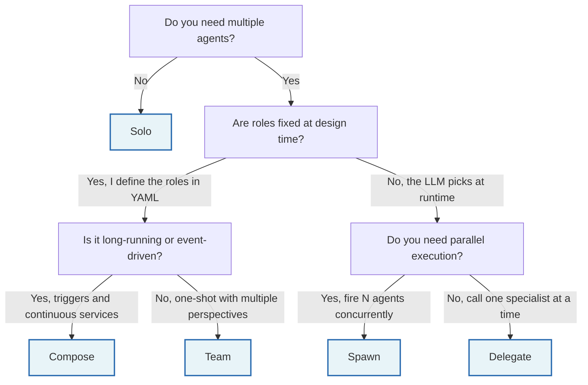
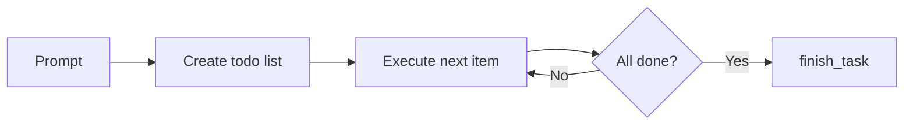
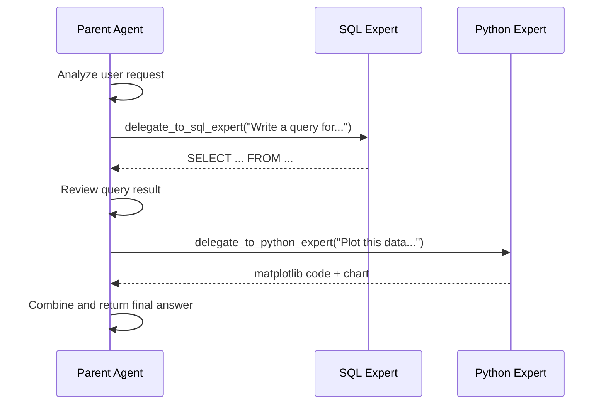
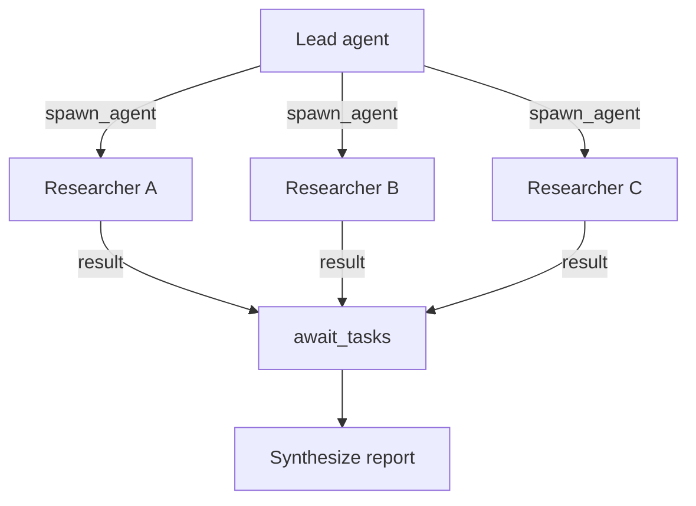
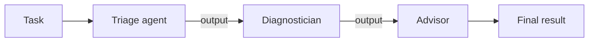
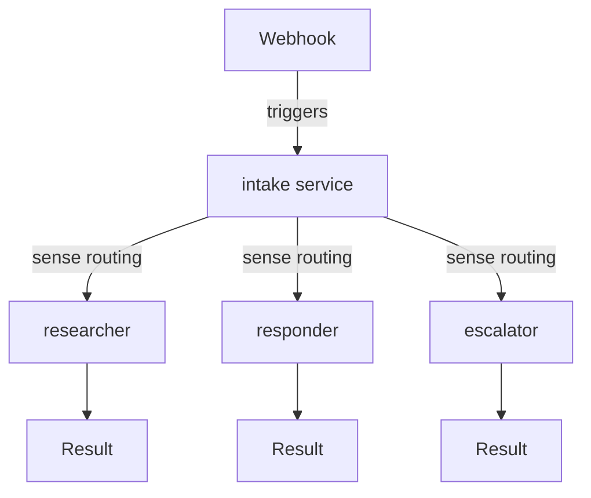
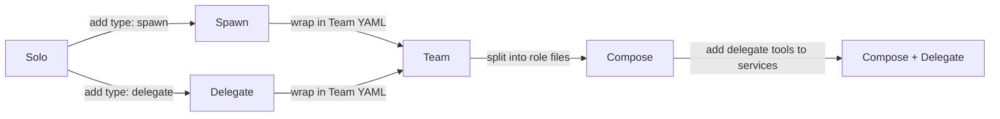

# Orchestration Patterns

InitRunner provides five orchestration patterns for coordinating agents. Each pattern addresses a different class of problem, from a single autonomous agent to a long-running daemon with event-driven services.

This guide covers all five patterns side-by-side: what they do, when to pick each one, complete YAML examples you can copy, common pitfalls, and how InitRunner compares to other agent frameworks.

**Quick version**: If you just need to pick a pattern fast, see [Choosing the right multi-agent pattern](multi-agent-guide.md). For deep dives on individual patterns, see the linked reference docs in each section below.

## Overview

| | Solo | Delegate | Spawn | Team | Compose |
|--|------|----------|-------|------|---------|
| **Kind** | `Agent` | `Agent` | `Agent` | `Team` | `Compose` |
| **Key config** | `spec.reasoning` | `spec.tools[type:delegate]` | `spec.tools[type:spawn]` | `spec.personas` | `spec.services` |
| **Who decides routing** | You + LLM | LLM (runtime) | LLM (runtime) | You (YAML) | You (YAML) |
| **Execution** | Iterative loop | Blocking tool call | Non-blocking tasks | Sequential or parallel | Graph-based (parallel fan-out) |
| **Lifetime** | One run | Within parent run | Within parent run | One run | One-shot or daemon |
| **Communication** | N/A | Tool call/response | Task submit/poll | Output handoff | Graph edges (DelegationEnvelope) |
| **Triggers** | No | No | No | No | Yes (cron, file, webhook) |
| **Shared memory** | N/A | Optional | Optional | Yes | Yes |
| **Error isolation** | Per-agent | Per-delegation | Per-task | Per-persona | Per-service |
| **Distributed** | No | Yes (MCP mode) | No | No | Yes (systemd) |
| **Files needed** | 1 | 3+ | 3+ | 1 | 2+ |
| **Typical agents** | 1 | 1-3 | 1-5 | 2-5 | 2-20 |
| **Best for** | Planning, research | Conditional routing | Parallel research | Multi-perspective review | Event pipelines, bots |

## Decision tree

Start here if you are not sure which pattern to use.



## Solo

One agent with reasoning tools. It plans, executes, reflects, and finishes on its own. No sub-agents.

**Use when** the task is complex but a single agent with the right tools can handle it. Most tasks start here. Add more patterns only when Solo is not enough.

**Kind**: `Agent` | **Key config**: `spec.reasoning`, `spec.autonomy`

### How it works



The agent receives a prompt, builds a plan using the `todo` tool, works through items one at a time, and calls `finish_task` when complete. Guardrails (max iterations, token budget) prevent runaway loops.

### Example: deployment verification

```yaml
apiVersion: initrunner/v1
kind: Agent
metadata:
  name: deployment-checker
  description: Checks endpoints and reports pass/fail results
spec:
  role: |
    You are a deployment verification agent. When given URLs to check:
    1. Create a todo list with one item per URL
    2. curl each endpoint and record the status code
    3. If a check fails, add a retry item with high priority
    4. Call finish_task with the overall status
  model:
    provider: openai
    name: gpt-5.4-mini-2026-03-17
    temperature: 0.0
  tools:
    - type: think
    - type: todo
      max_items: 15
    - type: shell
      allowed_commands: [curl]
      timeout_seconds: 30
  reasoning:
    pattern: todo_driven
    auto_plan: true
  autonomy:
    max_history_messages: 20
  guardrails:
    max_iterations: 8
    autonomous_token_budget: 30000
    max_tool_calls: 20
```

```bash
initrunner run role.yaml -a -p "Check https://api.example.com/health and https://api.example.com/ready"
```

### Key considerations

- Start with Solo before reaching for multi-agent patterns. It handles more than you think.
- `max_iterations` and `autonomous_token_budget` are your safety net. Set them.
- Reasoning patterns (`todo_driven`, `plan_execute`, `reflexion`) change how the agent structures its work. See [Reasoning strategies](../core/reasoning.md).
- The `-a` flag activates the agentic loop. Without it, the agent runs a single prompt-response cycle.

**Deep dive**: [Autonomous execution](autonomy.md)

---

## Delegate

A parent agent calls sub-agents as blocking tool calls. The parent sends a prompt, waits for the sub-agent to finish, gets the result, and continues reasoning.

**Use when** the parent needs to consult specialists one at a time and the LLM decides who to call at runtime. Good for conditional routing ("if the user asks about SQL, delegate to the SQL expert").

**Kind**: `Agent` | **Key config**: `spec.tools[type:delegate]`

### How it works



Each delegation is a blocking tool call. The sub-agent runs with a fresh context (no history from the parent). `max_depth` prevents infinite loops when agents delegate to each other.

### Example: research coordinator

```yaml
apiVersion: initrunner/v1
kind: Agent
metadata:
  name: research-coordinator
  description: Delegates research and writing to specialist agents
spec:
  role: |
    You are a research coordinator. Your workflow:
    1. Break the request into research questions
    2. Delegate each question to the researcher agent
    3. Collect findings, then delegate to the writer for a polished report
    4. Review and return the final output

    Always delegate. Do not research or write long-form content yourself.
  model:
    provider: openai
    name: gpt-5-mini
    temperature: 0.2
  tools:
    - type: delegate
      mode: inline
      max_depth: 2
      timeout_seconds: 120
      shared_memory:
        store_path: ./.initrunner/shared-research.db
        max_memories: 500
      agents:
        - name: researcher
          role_file: ./agents/researcher.yaml
          description: Gathers information from the web on a given topic
        - name: writer
          role_file: ./agents/writer.yaml
          description: Turns research notes into polished, structured writing
  guardrails:
    max_tokens_per_run: 100000
    max_tool_calls: 30
    timeout_seconds: 600
```

```bash
initrunner run coordinator.yaml -p "Research and summarize recent advances in fusion energy"
```

### Key considerations

- Delegation is **blocking**. The parent waits for the sub-agent to finish. For parallel work, use Spawn instead.
- Always set `max_depth` (default: 3). Without it, circular delegation chains can loop.
- `mode: inline` runs sub-agents in-process (good for dev). `mode: mcp` calls remote agents via HTTP (good for production, k8s).
- `shared_memory` lets sub-agents read/write to the same memory store as the parent. Inline mode only.

**Deep dive**: [Delegation](delegation.md)

---

## Spawn

A parent agent spawns sub-agents as non-blocking background tasks. The parent fires off multiple agents in parallel, then polls or awaits their results.

**Use when** you need the LLM to decide what to parallelize at runtime. The classic use case is research: "investigate these 3 topics concurrently, then synthesize."

**Kind**: `Agent` | **Key config**: `spec.tools[type:spawn]`

### How it works



The parent calls `spawn_agent()` which returns a task ID immediately. Multiple agents run concurrently (up to `max_concurrent`). The parent uses `poll_tasks()` to check status or `await_tasks()` to block until all are done.

### Example: research team

```yaml
apiVersion: initrunner/v1
kind: Agent
metadata:
  name: research-team
  description: Spawns parallel researchers and synthesizes findings
spec:
  role: |
    You are a research team lead. Your workflow:

    ## Planning
    1. Break the topic into distinct research questions (batch_add_todos)
    2. Identify which questions can run in parallel

    ## Research
    3. Spawn web-searcher agents for parallel questions
    4. Use await_tasks to collect results
    5. Spawn a summarizer for cross-cutting synthesis

    ## Synthesis
    6. Combine findings into a structured report
    7. Use think to reason about gaps and confidence levels
  model:
    provider: openai
    name: gpt-5.4-mini-2026-03-17
    temperature: 0.3
  tools:
    - type: think
      critique: true
    - type: todo
      max_items: 15
    - type: spawn
      max_concurrent: 3
      timeout_seconds: 120
      agents:
        - name: web-searcher
          role_file: ./agents/web-searcher.yaml
          description: Searches the web and returns structured findings
        - name: summarizer
          role_file: ./agents/summarizer.yaml
          description: Synthesizes research findings into structured summaries
  reasoning:
    pattern: todo_driven
    auto_plan: true
  autonomy:
    max_history_messages: 40
  guardrails:
    max_iterations: 12
    autonomous_token_budget: 100000
    max_tool_calls: 40
```

```bash
initrunner run role.yaml -a -p "Compare the top 3 vector databases for production RAG"
```

### Key considerations

- Spawning 3 agents costs roughly 3x the tokens of one agent. Use Spawn when wall-clock time matters more than token cost.
- `max_concurrent` controls the semaphore. Set it based on your API rate limits.
- Sub-agents run with fresh context. Pass all necessary information in the spawn prompt.
- Combine with `todo_driven` reasoning so the lead agent tracks what has been spawned, what has returned, and what still needs work.

**Deep dive**: [Reasoning strategies](../core/reasoning.md)

---

## Team

Multiple personas process the same task in a single YAML file. In sequential mode, each persona sees all prior output. In parallel mode, all personas run independently on the same prompt.

**Use when** you want structured multi-perspective analysis with a fixed set of roles. The roles are defined at design time in YAML, not chosen by the LLM at runtime.

**Kind**: `Team` | **Key config**: `spec.personas`

### How it works



In sequential mode (the default), the task flows through personas in order. Each persona receives the original task plus all prior persona outputs wrapped in `<prior-agent-output>` tags. In parallel mode, all personas run concurrently on the same prompt and their outputs are concatenated.

### Example: Kubernetes troubleshooting

```yaml
apiVersion: initrunner/v1
kind: Team
metadata:
  name: kube-advisor-team
  description: Multi-persona Kubernetes troubleshooting pipeline
spec:
  model:
    provider: openai
    name: gpt-5-mini
    temperature: 0.1
  shared_memory:
    enabled: true
    max_memories: 500
  personas:
    triage: |
      You are a Kubernetes triage agent. Gather initial cluster state
      and identify the problem layer.
      1. Run cluster_health for a cluster-wide overview
      2. Scope to the affected namespace with recent_events
      3. Categorize: pod, network, node, storage, config, or rollout
      Output a structured triage summary with affected resources,
      symptoms, events, and initial hypothesis.
    diagnostician: |
      You are a Kubernetes diagnostician. You receive a triage summary
      and perform deep investigation to find the root cause.
      1. Run the appropriate diagnostic script for the affected layer
      2. Use think to reason through the evidence chain
      Output: root cause, evidence, confidence level.
      Do not propose fixes -- that is the advisor's job.
    advisor: |
      You are a remediation advisor. You receive a diagnosis and
      provide actionable fix instructions.
      - Include exact kubectl commands for each step
      - Rank fixes by risk (safest first)
      - Include rollback plans for destructive operations
      - Add verification commands after each step
  tools:
    - type: shell
      allowed_commands: [kubectl, helm]
      timeout_seconds: 30
    - type: think
    - type: filesystem
      root_path: ./references
      read_only: true
  handoff_max_chars: 8000
  guardrails:
    max_tokens_per_run: 40000
    max_tool_calls: 25
    team_token_budget: 120000
    team_timeout_seconds: 600
```

```bash
initrunner run team.yaml --task "Pods are pending in staging"
```

### Key considerations

- Sequential mode: each persona sees all prior output. With many personas or long outputs, the last persona's context grows large. Use `handoff_max_chars` to cap it.
- Everything is in one file. No separate role files needed. Good for tight collaboration where personas share tools and memory.
- `team_token_budget` caps total tokens across all personas. `max_tokens_per_run` caps each individual persona.
- Parallel mode (`strategy: parallel`) is useful when personas do not need to see each other's work (e.g., independent code reviews).

**Deep dive**: [Team mode](team_mode.md)

---

## Compose

Long-running daemon with independent services, triggers, and message routing. Each service wraps a role YAML file. Services communicate through delegate sinks.

**Use when** you need event-driven agents that run continuously and route work between each other. Compose is for always-on pipelines: monitoring bots, support desks, CI/CD watchers.

**Kind**: `Compose` | **Key config**: `spec.services`

### How it works



The compose topology is compiled into a pydantic-graph execution graph. Each service becomes a graph step. Fan-out delegation uses Fork/Join for parallel execution; routing strategies (`keyword`/`sense`) use Decision nodes. In daemon mode, trigger events (webhooks, cron, file watchers) spawn independent graph runs via a bounded ingress queue.

### Example: support desk

```yaml
apiVersion: initrunner/v1
kind: Compose
metadata:
  name: support-desk
  description: >
    Support desk with intelligent auto-routing. Intake summarizes
    incoming requests, sense routing sends each to the right handler.
spec:
  services:
    intake:
      role: roles/intake.yaml
      sink:
        type: delegate
        strategy: sense          # keyword scoring + LLM tiebreak
        target:
          - researcher
          - responder
          - escalator

    researcher:
      role: roles/researcher.yaml
      depends_on: [intake]

    responder:
      role: roles/responder.yaml
      depends_on: [intake]
      restart:
        condition: on-failure
        max_retries: 3
        delay_seconds: 5

    escalator:
      role: roles/escalator.yaml
      depends_on: [intake]
```

```bash
initrunner compose up support-desk/compose.yaml
```

### Key considerations

- Compose services stay alive between triggers. Good for steady workloads, overkill for rare events (use a webhook-triggered Solo agent instead).
- `depends_on` controls startup order. Delegate sink targets do not need to be listed in `depends_on` -- the orchestrator handles that.
- `restart` policies (`on-failure`, `always`) keep services resilient. Set `max_retries` to avoid infinite restart loops.
- `strategy: sense` calls the LLM to pick the best target. Use `keyword` for zero API calls, `all` to fan out everywhere.
- Compose can run as a systemd service for production. See [Compose orchestration](agent_composer.md) for `compose install`.

**Deep dive**: [Compose orchestration](agent_composer.md) | [Sinks and routing](sinks.md)

---

## Migration paths

Patterns compose and upgrade naturally. Start simple, add complexity only when you need it.



### Solo to Spawn

Your Solo agent needs to research 3 topics in parallel. Add a `spawn` tool to its existing YAML:

```yaml
tools:
  - type: think
  - type: todo
  - type: spawn           # add this
    max_concurrent: 3
    agents:
      - name: researcher
        role_file: ./agents/researcher.yaml
        description: Web research specialist
```

Everything else stays the same. The agent now has `spawn_agent()` and `await_tasks()` available.

### Solo to Delegate

Your Solo agent needs specialized SQL expertise. Add a `delegate` tool:

```yaml
tools:
  - type: think
  - type: delegate         # add this
    mode: inline
    max_depth: 2
    agents:
      - name: sql-expert
        role_file: ./agents/sql-expert.yaml
        description: Writes and optimizes SQL queries
```

### Spawn/Delegate to Team

Your research agent with spawn tools now needs a fixed editorial review step after synthesis. Create a Team YAML that wraps the researcher as one persona and adds an editor:

```yaml
kind: Team
spec:
  personas:
    researcher: |
      You are a research lead. Use spawn tools to gather information.
    editor: |
      You review the research output for accuracy and clarity.
  tools:
    - type: spawn
      agents:
        - name: web-searcher
          role_file: ./agents/web-searcher.yaml
```

### Team to Compose

Your Team pipeline needs to run on a schedule and respond to webhooks. Move each persona to its own role file and wire them in a Compose definition:

```yaml
kind: Compose
spec:
  services:
    researcher:
      role: roles/researcher.yaml
      trigger:
        type: cron
        schedule: "0 9 * * *"    # daily at 9am
      sink:
        type: delegate
        target: editor
    editor:
      role: roles/editor.yaml
      depends_on: [researcher]
```

## Pattern combinations

Patterns nest inside each other. A few common setups:

**Team with delegate tools.** One persona in a Team uses `type: delegate` to call external specialists. The persona acts as a coordinator within the larger team pipeline.

**Compose with spawn services.** A Compose service uses `type: spawn` internally to parallelize its work. The service fans out to sub-agents, collects results, and sends the synthesized output through its sink.

**Compose with autonomous services.** A Compose service has `reasoning: todo_driven` and `autonomy: {}`. Each trigger starts an iterative agentic loop, not just a single prompt-response.

## Competitive comparison

How InitRunner's patterns map to other agent frameworks. Comparison current as of March 2026.

### Pattern mapping

| InitRunner | LangGraph | CrewAI | AutoGen | OpenAI Swarm |
|------------|-----------|--------|---------|--------------|
| Solo | Single-node graph | Single agent | `AssistantAgent` | Single agent |
| Delegate | Tool-calling subgraph | `delegate_work=True` | Nested chat | `transfer_to_*` handoffs |
| Spawn | Parallel branch + fan-in | `process: "parallel"` | Parallel group chat | N/A |
| Team | Multi-node sequential graph | Crew (sequential process) | Sequential group chat | Multi-agent with handoffs |
| Compose | LangGraph Cloud deployment | N/A | N/A | N/A |

### Feature comparison

| | InitRunner | LangGraph | CrewAI | AutoGen |
|--|------------|-----------|--------|---------|
| **Config format** | YAML, no code required | Python graph DSL | Python decorators | Python classes |
| **Runtime model** | CLI + daemon + systemd | Server deployment | In-process | Conversation loop |
| **Agent communication** | Tool calls + graph edges | Graph edges + shared state | Delegation + context | Chat messages |
| **Built-in persistence** | Yes (LanceDB, SQLite) | Checkpointing | No | No |
| **Built-in triggers** | Yes (cron, file, webhook) | No (external) | No (external) | No (external) |
| **Distributed mode** | MCP + systemd | LangGraph Cloud | No | No |
| **Observability** | Built-in OpenTelemetry | LangSmith | No | AutoGen Studio |

### What sets InitRunner apart

**YAML-first configuration.** Switching from Solo to Team to Compose is a YAML change, not a code rewrite. You do not need to learn a new API for each pattern. Other frameworks require Python code for every pattern, which means rewriting agent logic when you change coordination strategy.

**Built-in lifecycle.** Triggers, sinks, memory, audit logging, and guardrails are all part of the platform. LangGraph and CrewAI require you to bolt on external schedulers and persistence layers. InitRunner ships them.

**Daemon-native.** Compose runs as a systemd service with health checks, restart policies, and structured logging. Other frameworks are typically run-once processes that need external supervision for long-running workloads.

**Progressive complexity.** Start with a Solo agent in one YAML file. Add a spawn tool for parallelism. Wrap it in a Team for multi-perspective review. Move to Compose for event-driven pipelines. Each step is additive -- you never throw away what you built.

## Pitfalls

Common mistakes and how to avoid them.

| Mistake | Why it hurts | Do this instead |
|---------|-------------|-----------------|
| Using Compose for a one-shot multi-perspective task | Compose is a daemon. Overkill when you just want 3 agents to review the same thing. | Use Team. One YAML file, no triggers needed. |
| Using Spawn when you only call one sub-agent at a time | Spawn's value is parallelism. Single sequential calls add a poll loop for no benefit. | Use Delegate. Simpler, blocking, no polling. |
| Putting all logic in the coordinator, making sub-agents trivial | The coordinator becomes the bottleneck. Sub-agents become expensive no-ops. | Give sub-agents real autonomy. Keep the coordinator thin. |
| Skipping `max_depth` on Delegate or Spawn | Agent A delegates to B, B delegates back to A. Infinite loop. | Always set `max_depth: 2` or `3`. |
| Sharing memory without a read/write contract | Agents overwrite each other's memories with conflicting data. | Assign roles: one writer, others read-only, or use namespaced keys. |
| Choosing Compose "for scale" when traffic is bursty | Services stay alive between triggers. Wasted resources for events that come once a day. | Use a webhook-triggered Solo agent. Move to Compose when you need inter-service routing. |

## Cost and performance

Mental models for token usage and latency across patterns. No benchmarks (they go stale), just rules of thumb.

**Token cost, lowest to highest** (for the same task):

1. **Solo** -- one agent, one context window. Cheapest.
2. **Delegate** -- adds sub-agent tokens, but only one at a time. Moderate.
3. **Team (sequential)** -- N persona runs. Each sees growing context from prior handoffs. Grows with the number of personas.
4. **Spawn** -- N parallel agents, each with a full context window. Costs scale linearly with concurrency.
5. **Compose** -- N services, each triggered independently. Highest total, but spread over time.

**Rules of thumb:**

- Spawning 3 researchers costs roughly 3x a single researcher. Worth it when wall-clock time matters more than token spend.
- Team sequential: the last persona sees all prior output. With 5 verbose personas, that is a lot of context. Use `handoff_max_chars` to cap handoff size.
- Compose services are idle between triggers. Cost accrues per-trigger, not per-second. The daemon process itself is cheap.
- Delegate with `mode: mcp` adds HTTP round-trip latency (100-500ms) but lets you scale sub-agents to separate machines.

## Quick reference

| I want to... | Pattern | Kind | Key config |
|--------------|---------|------|------------|
| Run one agent with planning | Solo | `Agent` | `spec.reasoning` + `spec.autonomy` |
| Consult specialists one at a time | Delegate | `Agent` | `spec.tools[type:delegate]` |
| Run specialists in parallel | Spawn | `Agent` | `spec.tools[type:spawn]` |
| Fixed multi-role review pipeline | Team | `Team` | `spec.personas` |
| Event-driven daemon with routing | Compose | `Compose` | `spec.services` |

## Further reading

- [Choosing the right multi-agent pattern](multi-agent-guide.md) -- quick decision guide
- [Autonomous execution](autonomy.md) -- Solo pattern deep dive
- [Delegation](delegation.md) -- Delegate pattern deep dive
- [Team mode](team_mode.md) -- Team pattern deep dive
- [Compose orchestration](agent_composer.md) -- Compose pattern deep dive
- [Sinks and routing](sinks.md) -- result routing between services
- [Triggers](../core/triggers.md) -- cron, file watch, webhook configuration
- [Reasoning strategies](../core/reasoning.md) -- todo_driven, plan_execute, reflexion
- [Memory system](../core/memory.md) -- shared memory configuration
